## 4.1 버블 정렬
빅 오 세계에서 알고리즘 효율성을 표기하는 새로운 카테고리를 알아보자. 지난 수십년간 수십 개의 정렬 알고리즘이 개발돼 왔다. 이러한 알고리즘은 모두 다음의 문제를 해결한다.

> 정렬되지 않은 배열이 주어졌을 때, 어떻게 오름차순으로 정렬할 수 있을까?

우선 "단순 정렬(simple sort)"라고 알려진 알고리즘 분류를 살피겠다.(쉽지만 더 빠르다고 알려진 정렬 알고리즘보다 비효율적이다.)

매우 기본적인 정렬 알고리즘인 버블 정렬(bubble sort)은 다음과 같은 단계를 따른다.

1. 배열 내에서 연속된 두 항목을 가리킨다. 처음에는 쳣 번째 항목과 두 번째 항목을 비교한다.

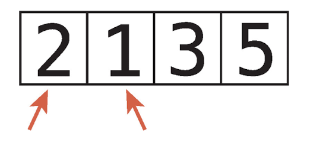

2. 두 항목의 순서가 뒤바뀌어 있으면(왼쪽보다 오른쪽 값이 크면) 두 항목을 교환(swap)한다.

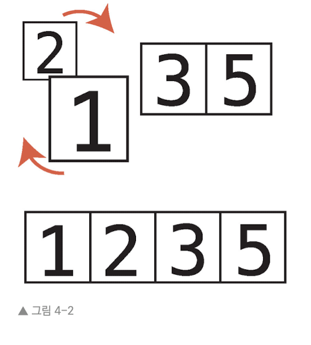

(순서가 올바르다면 그냥 넘어간다.)

3. '포인터'를 오른쪽으로 한 셀씩 옮긴다.

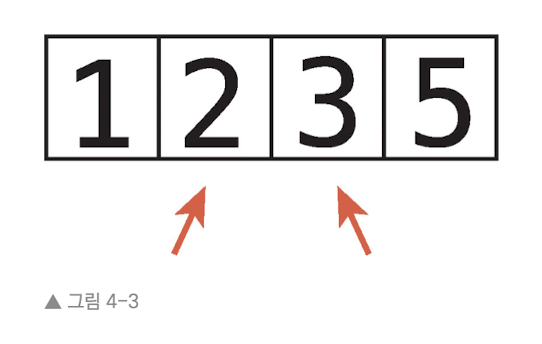

배열의 끝까지 또는 이미 정렬된 어떤 항목까지 1단계와 2단계를 반복한다.

4. 더 이상 교환하지 않을 때까지 1단계~3단계를 반복한다. 더는 교환하지 않는다는 것은 배열이 정렬된 상태라는 뜻이다. 1단계부터 3단계까지의 반복을 패스스루(passthrough)라고 한다. 알고리즘의 주요 단계를 "통과"했다는 의미이며 완전히 정렬될 때까지 반복한다.


---


## 4.2 버블 정렬 실제로 해보기
[4, 2, 7, 1, 3]이라는 배열을 정렬하고 싶다고 가정하자.

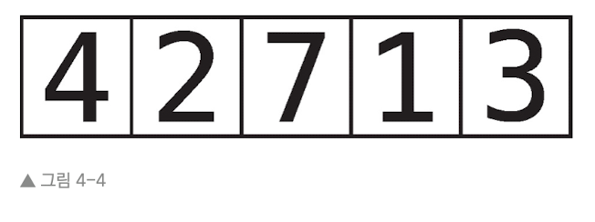

* 첫 번째 패스스루를 시작하자

1. 먼저 4와 2를 비교한다. 순서가 맞지 않다.

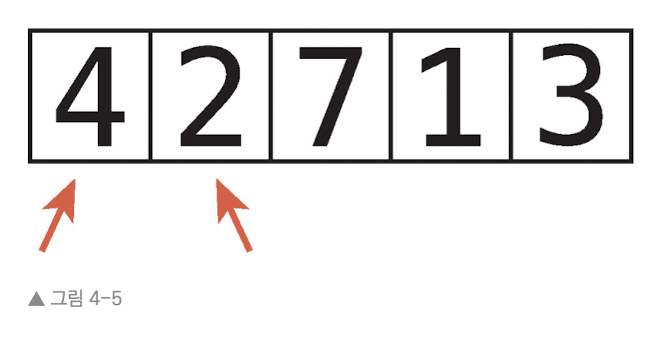

2. 따라서 둘을 교환한다.

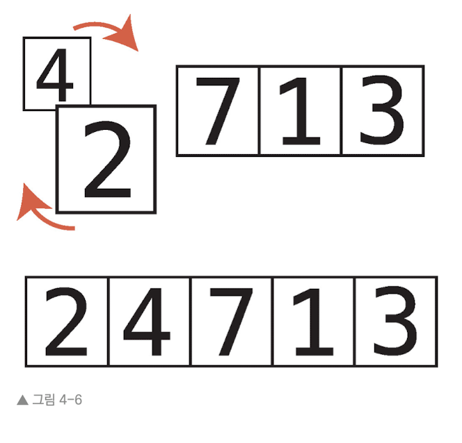

3. 다음으로 4와 7을 비교한다.

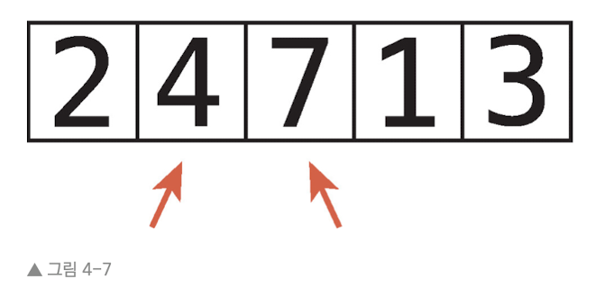

순서가 올바르니 다음 단계로 넘어간다.

4. 7과 1을 비교한다. 순서가 맞지 않는다.

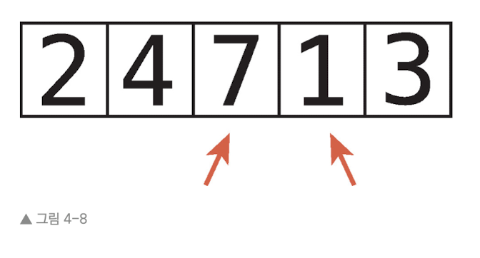

5. 순서가 맞지 않으므로 교환한다.

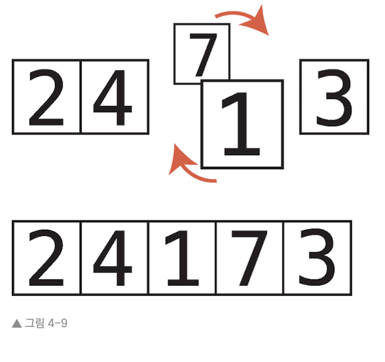

6. 7과 3을 비교한다. 순서가 맞지 않는다.

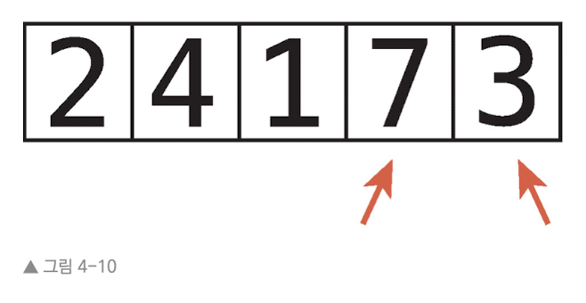

7. 순서가 맞지 않으므로 교환한다.

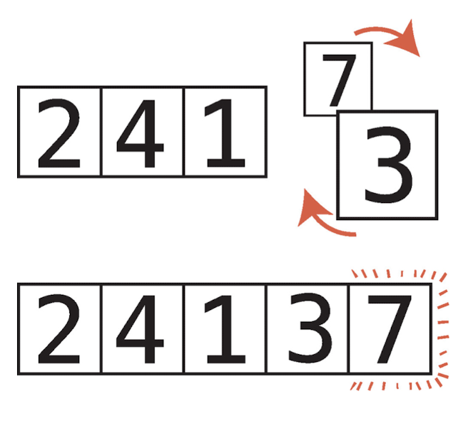

이제 7은 배열 내에서 올바른 위치에 있다. 이 알고리즘을 버블 정렬이라고 부르는 까닭이 바로 여기에 있다. 각 패스스루마다 정렬되지 않은 값 중 가장 큰 값. "버블"이 올바른 위치로 가게 된다.

* 두 번째 패스스루를 시작하자. 7은 이미 올바른 위치에 있다.

8. 2와 4를 비교한다.

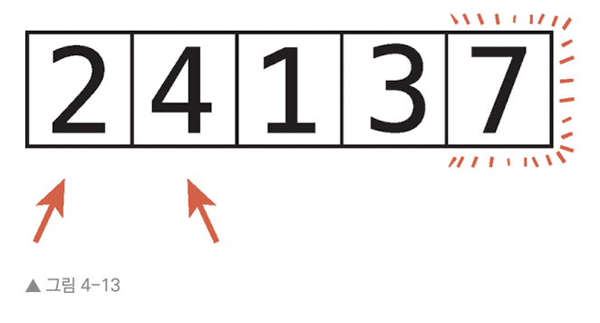

올바른 순서이므로 다음으로 넘어간다.

9. 4와 1을 비교한다. 순서가 맞지 않는다.

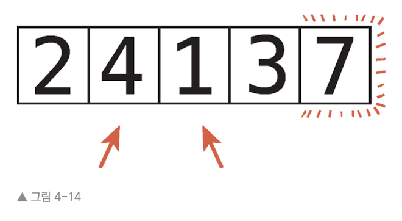

10. 순서가 맞지 않으므로 교환한다.

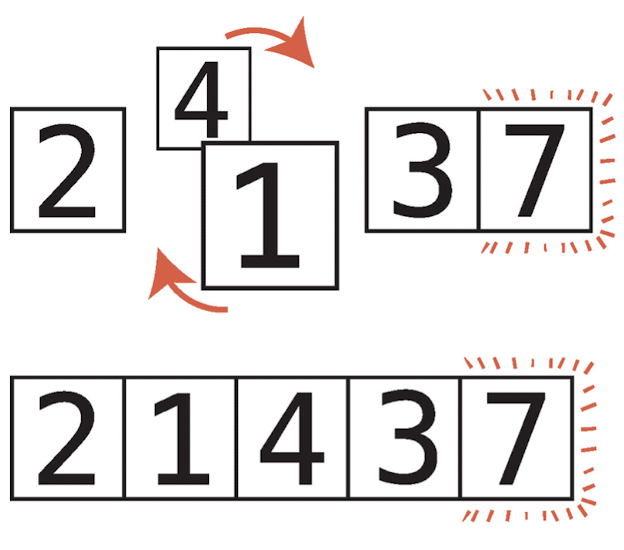

11. 4와 3을 비교한다. 순서가 맞지 않는다.

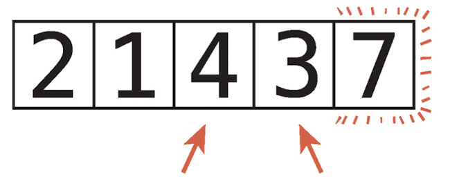

12. 순서가 맞지 않으므로 교환한다.

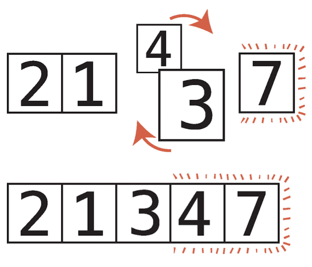

이제 4와 7은 올바른 위치에 있다. 이렇게 패스스루를 반복하며 완전히 정렬이 될 때까지 과정을 반복한다.

---


## 4.3 버블 정렬 구현
다음은 파이썬으로 구현한 버블 정렬이다.

```Python
def bubble_sort(list):
    
    # 어떤 인덱스까지 아직 정렬이 되지 않았는지 기록한다.
    # 처음에는 전체 배열이 정렬되지 않은 상태이므로 
    # 배열의 마지막 인덱스로 변수를 초기화 한다.
    unsorted_until_list = len(list) - 1

    # 배열의 정렬 여부를 기록하는 sorted 변수
    sorted = False

    # while 루프: 배열이 정렬될 때까지 계속 실행한다.
    while not sorted:

        # 먼저 sorted에 True를 할당한다.
        # 만약 어떤 값도 교환하지 않고 패스스루를 통과한다면
        # 그대로 sorted = True가 되어 배열이 완전히 정렬된 상태로 인식한다.
        sorted = True

        # while 루프 내 for 루프
        # 첫 인덱스부터 아직 정렬되지 않은 인덱스까지 수행한다.
        # 교환하게 되면 sorted 변수를 False로 바꾼다.
        for i in range(unsorted_until_index):
            if list[i] > list[i+1]:
                sorted = False
                list[i], list[i+1] = list[i+1], list[i]
        unsorted_until_index = unsorted_until_index - 1 # 패스스루를 하나 완료했으며 마지막으로 간 '버블'이 올바른 위치로 정렬이 되었으므로 unsorted_until_index 값을 1 감소시킨다.

list = [65, 55, 45, 35, 25, 15, 10]

bubble_sort(list)

print(list)
```


---


## 4.4 버블 정렬의 효율성
버블 정렬 알고리즘에 포함된 단계는 두 종류이다.

* 비교: 어느 쪽이 더 큰지 두 수를 비교한다.
* 교환(swap): 정렬하기 위해 두 수를 비교한다.

원소 N개가 있을 때 (N - 1)+(N - 2)+(N - 3)...+1번의 비교를 수행한다. 이처럼 원소가 늘어난다면 굉장히 비효율적으로 늘어나게 된다.

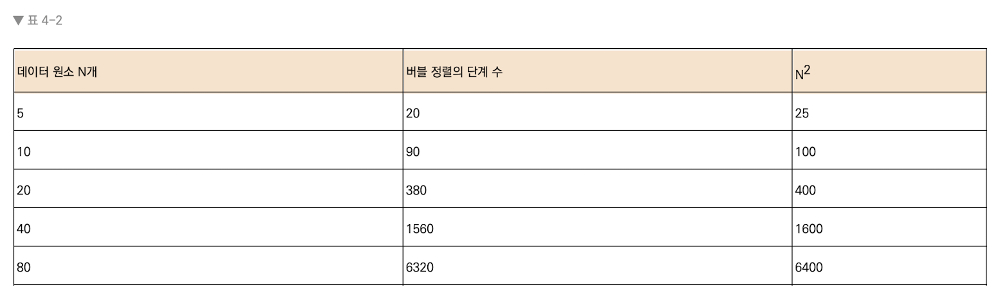

따라서 빅 오 표기법에서 버블 정렬의 효율성을 O($N^{2}$)라고 부른다.

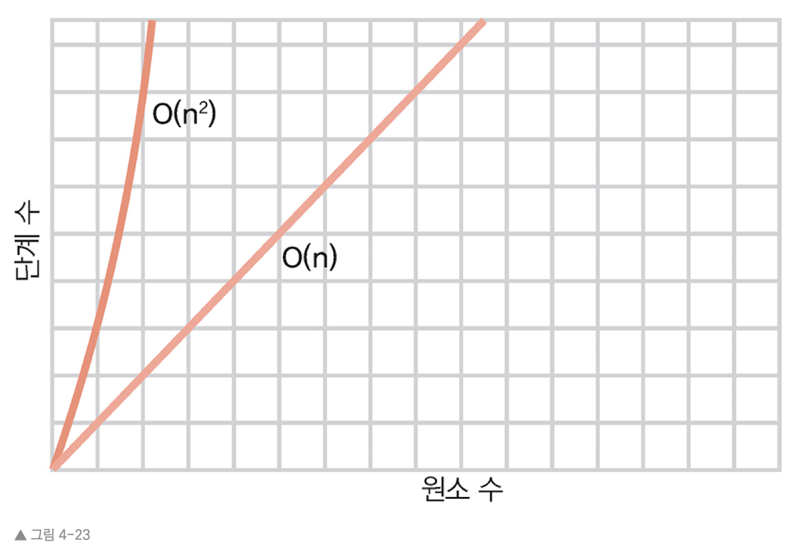

참고로 O($N^{2}$)를 이차 시간(quadratic times)이라고도 부른다.


---


## 4.5 이차 문제
배열에 중복 값이 있는지 확인하는 자바스크립트 애플리케이션을 작성한다고 해보자

```Javascript
function hasDuplicateValue(array){
    for(var i = 0; i < array.length; i++){
        for(var j = 0; i < array.length; j++){
            if(i !== j && array[i] == array[j]){
                return true;
            }
        }
    }
    return false;
}
```

위 함수는 var i를 사용해 배열 내 각 원소를 순회한다. 이어서 i 내에서 각 원소를 살펴야 하므로 var j로 배열 내 모든 원소를 순회하는 두 번째 for 루프를 실행하고 i와 j 인덱스에 있는 두 원소가 같은지 확인한다. 루프를 모두 실행했는데 어떤 중복 값도 찾지 못했다면 중복이 없었음을 의미하는 false를 반환한다.

결론적으로 배열에 원소 N개가 있다면 함수는 $N^2$번의 비교를 수행할 것이다. 바깥 루프는 배열을 전부 살펴보기 위해 무조건 N번을 순회하고, 매 순회마다 안쪽 루프는 다시 N번을 순회해야 하기 때문이다. 즉 O($N^2$)의 알고리즘이다.


---


## 4.6 선형 해결법
다음은 중첩 루프를 쓰지 않는 hasDuplicateValue 함수이다.

```Javascript
function hasDuplicateValue(array){
    var existingNumbers = [];
    for(var i = 0; i < array.length; i++){
        if(existingNumbers[array[i]] === undefined) {
            existingNumbers[array[i]] = 1;
        } else {    // existingNumbers[array[i]]의 값이 이미 있다면(중복)
            return True;
        }
    } 
    return false;
}

```

위 구현에는 루프가 하나이며, 찾아봤던 수를 existingNumbers라는 배열에 기록해 둔다. 코드가 새로운 수를 찾을 때마다 이 수에 대응하는 existingNumbers 배열의 인덱스 값에 1을 저장하는 식이다.

예를 들어 [3, 5, 8]이라는 array가 있을 때 루프가 종료된 후 existingNumbers의 배열은 다음과 같을 것이다.

```
[undefined, undefined, undefined, 1, undefined, 1, undefined, undefined, 1]
```

인덱스 3, 5, 8에 1이 들어 있다. 즉 주어진 array에 3, 5, 8이 있다는 뜻이다.

하지만 코드는 적절한 인덱스에 1을 저장하기 전에 이 인덱스에 이미 값 1이 들어 있는지 확인한다. 들어 있다면 이미 찾아봤던 수라는 의미로, 즉 중복 값을 찾은 것이다.

이전과 마찬가지로 최악의 시나리오는 배열에 중복 값이 없을 떄다. 이때 함수는 배열의 전체 루프를 수행해야 한다.

새로운 알고리즘은 데이터 원소가 N개 있을 때 비교를 N번 진행한다. 단 하나의 루프에서 배열에 있는 원수 수만큼 순회하기 때문이다. 따라서 빅 오 표기법은 O(N)이다.


---
