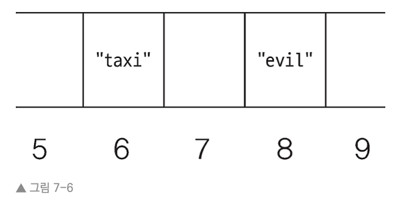
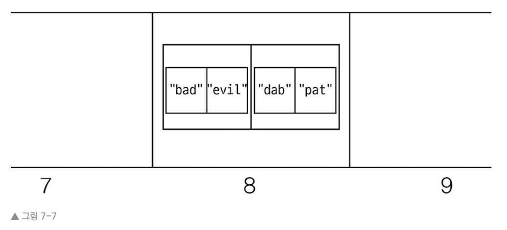

# 7 해시 테이블을 이용한 매우 빠른 룩업

```Python
menu = [["french fries", 0.75], ["hamburger", 2.5], ["hot dog", 1.5], ["soda", 0.6]]
```
위 배열은 몇 개의 하위 배열을 포함하며 각 하위 배열은 두 원소를 포함한다. 위 정렬이 정렬되어 있지 않다면, 주어진 음식의 가격을 검색하는 데 O(N) 단계가 걸릴 것이다. 정렬된 배열이라면 이진 검색을 수행하여 O(log N) 단게가 걸린다.

7장에서는 해시 테이블이라는 특수한 자료 구조를 살피고 어떻게 사용하면 좋을지 알아볼 것이다.

---


## 7.1 해시 테이블 소개
대부분의 프로그래밍 언어는 해시 테이블(hash table)이라는 자료 구조를 포함하며, 해시 테이블에는 빠른 읽기라는 놀라운 능력이 있다. 다양한 프로그래밍 언어에서 서로 다른 언어로 불리는데, 해시, 맵, 해시 맵, 딕셔너리, 연관 배열 등의 이름을 갖는다.

다음은 해시 테이블을 사용해 루비로 구현한 메뉴 예제다.

```Ruby
menu = {"french fries" => 0.75, "hamburger" => 2.5, "hot dog" => 1.5, "soda" => 0.6} 
```

해시 테이블은 쌍으로 이뤄진 값들의 리스트다. 첫 번째 항목을 키(key)라고 부르고, 두 번째 항목을 값(value)라고 부른다. 위 예제에서 "french fries"라는 문자열이 키(key)고 0.75가 값(value)이다.

루비에서는 다음과 같은 문법으로 키(key) 값을 룩업할 수 있다.

```Ruby
menu["french fries"]
```

위 코드는 0.75라는 값을 반환한다.

해시 테이블의 값 룩업은 딱 한 단계만 걸리므로 평균적으로 효율성이 O(1)이다. 이유를 알아보자.


--


## 7.2 해시 함수로 해싱
예를 들어 다음처럼 단순하게 글자와 숫자를 짝지을 수 있다.

```
A = 1

B = 2

C = 3

D = 4

E = 5
```

위 코드에 따르면

ACE는 135로,

CAB는 312로,

DAB는 412로 변환된다.

이처럼 문자를 가져와 숫자로 변환하는 과정을 해싱이라고 한다. 또한 글자를 특정 숫자로 변환하는 데 사용한 코드를 해시 함수라고 부른다.

이 밖에도 해시 함수는 많다. 또 다른 해시 함수 예제는 각 문자에 해당하는 숫자를 가져와 모든 수를 합쳐 반환한다. 예시로 위의 규칙을 따르면 BAD는

1. BAD는 214로 변환된다.

2. 각 숫자를 합친다. 2 + 1 + 4 = 7이다.

또 다른 예시는 모든 수를 곱해서 반환한다.

1. BAD는 214로 변환된다.

2. 각 숫자를 곱한다. 2 * 1 * 4 = 8이다.


하지만 곱셈과 덧셈 해시는 같은 결과가 나올 수 있다. 예시로 위와 같은 규칙을 적용하면 DAB나 BAD 모두 같은 값으로 변환된다. 


---


## 7.3 재미와 이익, 특히 이익을 남길 유의어 사전 만들기
Quickasaurus라는 유의어 사전을 만든다고 하자. 이 사전에서 단어를 룩업하면 유의어를 모두 반환하는 대신 그 단어의 가장 인기 있는 유의어를 반환하게 할 것이다.

모든 단어에는 각각 연관된 동의어가 있으므로 동의어는 해시 테이블의 좋은 사례(use case)이다. 

다음과 같은 해시 테이블로 유의어 사전을 표현할 수 있다.

```Ruby
thesaurus = {}
```

배열과 유사하게 해시 테이블은 내부적으로 데이터를 한 줄로 이뤄진 셀 묶음에 저장한다. 각 셀마다 주소가 있다. 예를 들면 다음과 같다.


첫 번째 항목을 해시에 추가해 보자.

```Ruby
thesaurus["bad"] = "evil"
```

코드로 표현하면 해시 테이블은 이제 다음과 같다.

```Ruby
{"bad" => "evil"}
```

해시 테이블이 데이터를 어떻게 저장하는지 알아보자.

먼저 컴퓨터는 키(key)에 해시를 적용한다. 앞서 설명한 "곱셈" 해시를 예로 들겠다.

BAD = 2 * 1 * 4 = 8

키 "bad"는 8로 해싱되므로 컴퓨터는 값 ("evil")을 다음과 같이 셀 8에 넣는다.


이제 다른 키/값 쌍을 추가해 보자

```Ruby
thesaurus["cab"] = "taxi"
```

다시 한번 컴퓨터는 키를 해싱한다.

CAB = 3 * 1 * 2 = 6

결과값이 6이므로 컴퓨터는 값 ("taxi")를 셀 6에 저장한다.


코드로 표현하면 해시 테이블은 현재 다음과 같다.

```Ruby
{"bad" => "evil", "cab" => "taxi"}
```

해시 테이블을 만들었으므로 해시 테이블에서 값을 어떻게 룩업하는지 알아보자. 키 "bad"의 값을 룩업하고 싶다고 하자. 코드는 다음과 같다.

```Ruby
thesaurus["bad"]
```

1. 컴퓨터는 룩업하고 있는 키를 해싱한다. BAD = 2 * 1 * 4 = 8
2. 결과가 8이므로 셀 8을 찾아가서 저장된 값("evil")을 반화한다.

이런 과정으로 룩업하기 때문에 빅 오 표기법으로 O(1)인 것이다.


---


## 7.4 충돌 해결
물론 해시 테이블도 문제를 가지고 있다.

위에서 예시로 든 유의어 사전을 계속 살펴보자. 다음과 같은 항목을 유의어 사진에 추가하면 무슨 일이 일어날까?

```Ruby
thesaurus["dab"] = "pat"
```

먼저 컴퓨터는 키를 해싱할 것이다. DAB = 4 * 1 * 2 = 8.

그리고 "pat"를 해시 테이블 셀 8에 추가하려 할 것이다. 하지만 셀 8에는 원래 "evil"이 있었다. 이렇게 이미 채워진 셀에 데이터를 추가하는 것을 충돌이라 부른다. 다행히 이 문제를 해결하는 방법이 여럿 있다.

충돌을 해결하는 고전적인 방법 중 하나로 분리 연결법이 있다. 충돌이 발생했을 때 셀에 하나의 값을 넣는 대신 배열로의 참조를 넣는 방법이다.



예제에서 컴퓨터는 셀 8에 "pat"을 넣으려고 했지만 이미 "evil"이 있었다. 따라서 셀 8을 배열로 대체한다. 



이렇게 바꿨을 때 해시 테이블 룩업이 어떻게 동작하는지 살펴보자. thesaurus["dab"]를 룩업할 때 컴퓨터는 다음과 같은 단계를 밟는다.

1. 컴퓨터는 키를 해싱한다. DAB = 4 * 1 * 2 = 8

2. 셀 8을 룩업한다. 컴퓨터는 셀 8이 하나의 값이 아닌 배열(이 들어간 배열)을 포함하고 있는 걸 알게 된다. 

3. 각 하위 배열의 인덱스 0을 찾고 룩업 중인 단어 "dab"를 찾을 때까지 배열을 검색한다. 일치하는 하위 배열의 인덱스 1에 있는 값을 반환한다.

이렇게 단계가 진행되는 경우 최악의 경우 해시 테이블 룩업 성능은 사실상 배열의 검색 과정이므로 O(N)과 다름 없다.

따라서 해시 테이블에 충돌이 거의 없도록 만들어야 한다.


---


## 7.5 훌륭한 충돌 조정
궁극적으로 해시 테이블은 다음 세 요인에 따라 효율성이 정해진다.

* 해시 테이블에 얼마나 많은 데이터를 저장하는가

* 해시 테이블에서 얼마나 많은 셀을 쓸 수 있는가

* 어떤 해시 함수를 사용하는가

여기서 좋은 해시 함수란 사용 가능한 모든 셀에 데이터를 분산시키는 함수다.

만약 5개의 값만 저장할 해시 테이블이 필요하다면 해시 테이블은 얼마나 커야 하며 어떤 종류의 해시 함수를 써야 할까?

해시 테이블에 셀이 5개만 있다면 키를 1과 5 사이로 변환할 해시 함수가 필요하다. 데이터를 5개만 저장해도 두 키가 같은 값으로 해싱될 수 있으므로 충돌이 일어나기 쉽다. 

하지만 해시 테이블에 셀이 100개 정도라면 데이터를 5개 저장하는 정도로 충돌이 일어날 가능성은 훨씬 적을 것이다. 하지만 데이터를 5개 저장하는 데 셀을 100개나 쓰는 것은 메모리 낭비다. 

따라서 해시 테이블은 충돌 조정을 수행하면서도 많은 메모리를 낭비하지 말아야 한다.

컴퓨터 과학자는 부하율(데이터와 셀 간의 비율)을 정의했는데, 이상적인 부하율을 0.7(원소 7개 / 셀 10개)로 말한다. 데이터를 7개 저장한다면 셀 10개로 이뤄진 해시를 할당하는 것이다. 만약 데이터가 더 추가된다면 컴퓨터는 셀을 더 추가하고 해시 함수를 바꿔서 확장할 것이다.


---


## 7.6 실제 예제
해시 테이블은 집합처럼 쓸 수 있는 경우가 많다. 배열을 집합으로 사용하면 단순히 각 데이터를 배열 내 한 셀에 넣는다. 하지만 해시 테이블을 집합으로 사용하면 각 데이터가 해시 테이블의 키가 되면서 값에 1이나 true 같은 불 값 등 무엇이든 넣을 수 있다.

자바스크립트로 해시 테이블 집합을 만들어 보자

```Javascript
var set = {};
```

값을 몇 개 집합에 추가해 보자.

```Javascript
set["apple"] = 1;

set["banana"] = 1;

set["cucumber"] = 1;

```

새 값을 삽입할 때마다 O(N)의 선형 검색 대신 단 O(1) 시간 내에 추가할 수 있다. 다음처럼 이미 존재하는 키를 추가해도 마찬가지다.

```Javascript
set["banana"] = 1;
```

또 다른 "banana"를 집합에 추가할 때 "banana"가 이미 있는지 확인하지 않아도 된다. 있다 해도 단순히 그 키의 값에 숫자 1을 겹쳐 쓸 것이기 때문이다.

사실 해시 테이블은 데이터 세트에 어떤 값이 있는지 알고 싶을 경우 안성맞춤이다. 4장에서 배열 내 중복 숫자가 있는지 확인하는 자바스크립트 함수를 구현한 적 있었다.(4.5, 4.6) 두 번째 해결책은 O(N)에 수행되긴 하지만 배열에 오로지 양수만 들어있을 때 동작한다. 배열이 문자열과 같은 다른 값을 포함하면 수행할 수 없었다.

해시 테이블을 사용하면 유사한 방법으로 문자열을 효과적으로 처리할 수 있다.

```Javascript
function hasDuplicateValue(array){

    // 배열 대신 해시 테이블을 사용한다.
    var existingValues = {};
    
    for(var i = 0; i < array.length; i++){
        if(existingValues[array[i]] === undefined) {
            existingValues[array[i]] = 1;
        } else {
            return true;
        }
    }

    return false;

}
```

위 방법도 O(N)으로 실행된다. 위 코드의 existingValues는 배열이 아닌 해시 테이블이므로 키에 정수뿐 아니라 문자열도 포함할 수 있다. 

다른 예시로 투표자가 후보자 목록 중에서 하나를 고르거나 또 다른 후보자를 작성할 수 있는 전자 투표 기계를 만든다고 하자. 오로지 선거가 끝났을 때만 최종 투표수를 센다면 투표를 간단한 배열로 저장해서 각 투표가 들어오는 대로 배열 끝에 삽입하면 된다.

```Javascript
var vote = [];

function addVote(candidate){
    votes.push(candidate)
}
```

이러면 매우 긴 배열이 결과로 나올 것이다. 삽입이야 O(1)만 걸리겠지만, 만약 최종 투표수를 센다면 모든 표를 세기 위해 O(N)이 걸릴 것이다. 이 방법은 너무 오래 걸린다.

이렇게 하는 대신 해시 테이블에 데이터를 저장하는 방법을 생각해 보자.

```Javascript
var vote = {};

function addVote(candidate){
    if(votes[candidate]){
        // 투표를 할 때마다 투표수를 기록한다.
        votes[candidate]++;
    }

    else{
        votes[candidate] = 1;
    }
}
```
위 방법으로 한다면 삽입이 O(1)일 뿐만 아니라 투표를 할 때 투표수를 기록하므로 최종 수표수를 세는 것도 O(1)이다.


---


