# 10 속도를 높이는 재귀 알고리즘
앞에서 버블 정렬, 선택 정렬, 삽입 정렬과 같은 많은 정렬 알고리즘을 살펴봤다. 하지만 실제로 배열을 정렬할 때는 이러한 방법을 쓰지 않는다. 컴퓨터 언어 대부분은 내장 정렬 함수가 있어서 사용자가 스스로 구현하는 데 필요한 시간과 노력을 아껴준다. 그 컴퓨터 언어 중 대다수가 내부적으로 채택한 정렬 알고리즘이 바로 퀵 정렬이다.

퀵 정렬은 분할이라는 개념이 기반하므로 분할을 먼저 알아볼 것이다.


---


## 10.1 분할
배열을 분할한다는 것은 배열에서 임의의 수를 가져와(이것을 앞으로 피벗이라고 한다.) 피벗보다 작은 모든 수는 피벗의 왼쪽에, 피벗보다 큰 모든 수는 피벗의 오른쪽에 두는 것이다.

다음과 같은 배열이 있다고 하자.

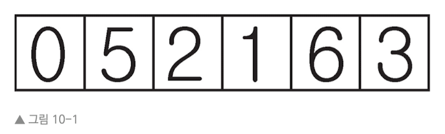

일관된 설명을 위해 제일 오른쪽에 위치한 값을 항상 피벗으로 고를 것이다.(물론 다른 값을 고를 수 있다.)

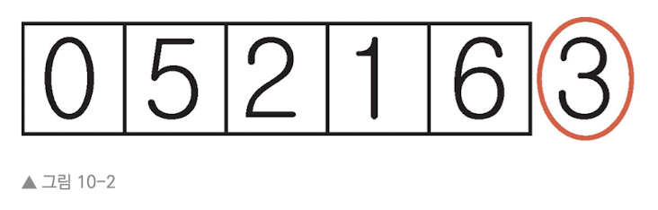

이어서 두 '포인터'를 사용해 하나는 배열 가장 왼쪽에 있는 값에, 다른 하나는 피벗을 제외한 배열 가장 오른쪽에 있는 값에 할당한다.

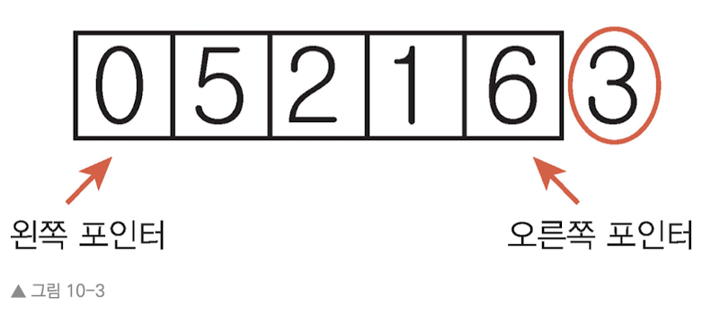

이제 다음과 같은 단계를 거쳐 분할을 진행한다.

1. 왼쪽 포인터를 한 셀씩 계속 오른쪽으로 옮기면서 피벗보다 크거나 같은 값에 도달하면 멈춘다.

2. 이어서 오른쪽 포인터를 한 셀씩 계속 왼쪽으로 옮기면서 피벗보다 작거나 큰 값에 도달하면 멈춘다.

3. 왼쪽 포인터와 오른쪽 포인터가 가리키고 있는 값을 교환한다.

4. 두 포인터가 가리키고 있는 값이 같거나 왼쪽 포인터가 오른쪽 포인터 바로 오른쪽으로 이동할 때까지 위 과정을 반복한다.

5. 끝으로 왼쪽 포인터가 현재 가리키고 있는 값과 피벗을 교환한다.

분할이 끝나면 피벗 왼쪽에 있는 값은 모두 피벗보다 작고, 피벗 오른쪽에 있는 값은 모두 피벗보다 크다. 또한 피벗을 제외하고 다른 값은 아직 정렬되지 않았지만, 피벗 자체는 배열 내 올바른 위치에 존재한다.

예제에 적용하면

1. 왼쪽 포인터(0을 가리키는)와 피벗(값 3)을 비교한다.

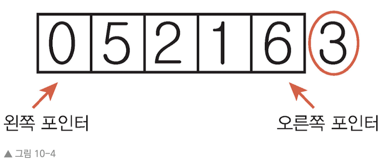

0은 피벗보다 작으므로 왼쪽 포인터를 한 셀 오른쪽으로 옮긴다.  왼쪽 포인터(5를 기리키는)와 피벗(값 3)을 비교한다. 5가 피벗보다 크므로 왼쪽 포인터를 멈춘다.

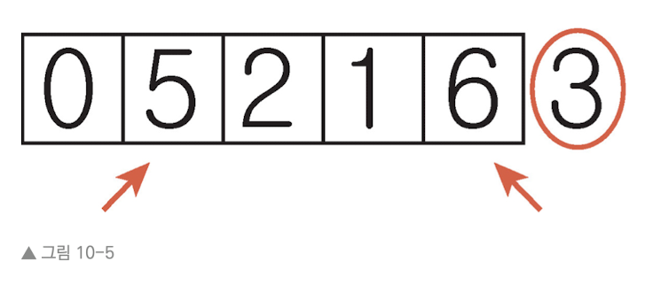

2. 오른쪽 포인터(6을 가리키는)와 피벗(값 3)을 비교한다. 피벗보다 값이 크므로 왼쪽으로 포인터를 한 셀만큼 옮긴다.

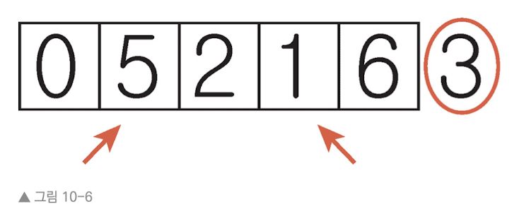

오른쪽 포인터(1)가 피벗(3)보다 작으므로 오른쪽 포인터를 멈춘다.

3. 두 포인터가 모두 멈췄으므로 두 포인터의 값을 교환한다.

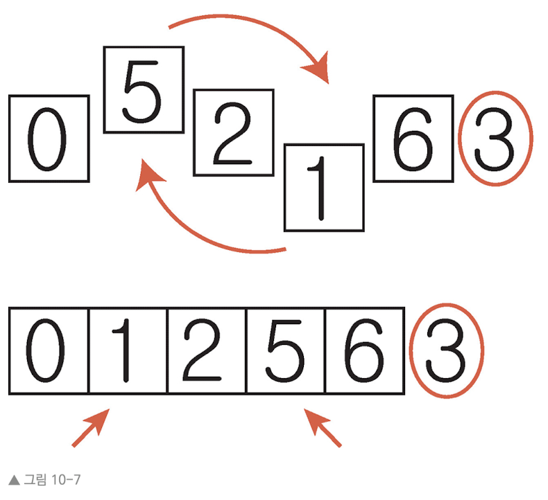

4. 다시 왼쪽 포인터를 이동시킨다.

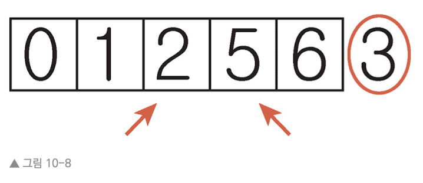

왼쪽 포인터(2)가 피벗(3)보다 작으므로 왼쪽 포인터를 옮긴다.

5. 왼쪽 포인터(5)와 오른쪽 포인터(5)가 같은 값을 가리키고 있다. 왼쪽 포인터(5)가 피벗(3)보다 큰 값을 가리키므로 멈춘다. 왼쪽 포인터가 오른쪽 포인터에 도달했으므로 포인터 이동은 중지한다.

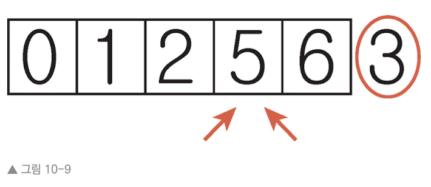

6. 분할의 마지막 단계로, 왼쪽 포인터가 가리키는 값을 피벗과 교환한다.

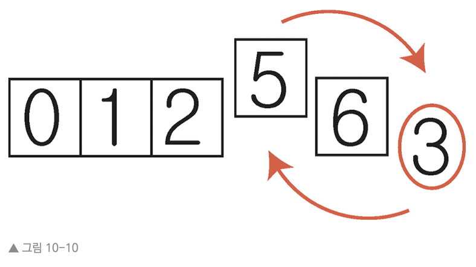

배열은 완전히 정리되지 않았지만, 분할은 성공적으로 끝난다. 피벗이 3이었으므로 3보다 작은 수는 모두 3의 왼쪽, 3보다 큰 수는 모두 3의 오른쪽에 위치한다.

다음은 루비로 구현한 SortableArray 클래스로 지금까지의 방법으로 배열을 분할하는 partition! 메서드를 포함한다.

```Ruby
class SortableArray

    attr_reader :array


    def initialize(array)

        @array = array

    end


    def partition!(left_pointer, right_pointer)

        # 항상 가장 오른쪽에 있는 값을 피벗으로 선택한다.
        pivot_position = right_pointer
        
        pivot = @array[pivot_position]

        # 피벗 바로 왼쪽에서 오른쪽 포인터를 시작한다.
        right_pointer -= 1

        while true do
            
            # 왼쪽 포인터가 가리키는 값 < 피봇 값이면 
            while @array[left_pointer] < pivot do
                
                # 왼쪽 포인터를 오른쪽으로 한 칸 움직인다.
                left_pointer += 1

            end

            # 오른쪽 포인터가 가리키는 값 > 피복 값이면
            while @array[right_pointer] > pivot do

                # 오른쪽 포인터를 왼쪽으로 한 칸 움직인다.
                right_pointer -= 1

            end

            # 왼쪽 포인터가 오른쪽 포인터와 같은 것을 가리키거나
            # 왼쪽 포인터가 오른쪽 포인터의 오른쪽에 위치했다면
            if left_pointer >= right_pointer

                # 루프를 멈춘다.
                break

            # 왼쪽 포인터가 멈췄고, 오른쪽 포인터도 멈췄으며
            # 왼쪽 포인터가 오른쪽 포인터보다 왼쪽에 있다면
            else

                # 포인터의 양쪽 값을 교환한다.
                # swap 함수는 하단에서 정의
                swap(left_pointer, right_pointer)

            end

        end


        # 마지막 단계로 왼쪽 포인터와 피벗을 교환한다.
        swap(left_pointer, pivot_position)

        # 이어지는 예제에 나올 quicksort 메서드를 위해 왼쪽 포인터를 반환한다.
        return left_pointer

        end


    def swap(pointer_1, pointer_2)

        temp_value = @array[pointer_1]

        @array[pointer_1] = @array[pointer_2]

        @array[pointer_2] = temp_value

    end


end

```

partition 메서드는 왼쪽 포인터와 오른쪽 포인터의 시작점을 매개변수로 받아 왼쪽 포인터가 끝났을 때의 최종 위치를 반환한다.


---


## 10.2 퀵 정렬
퀵 정렬의 알고리즘은 다음과 같이 동작한다.

1. 배열을 분할한다. 피벗은 이제 올바른 위치에 있다.

2. 피벗의 왼쪽과 오른쪽에 있는 하위 배열을 각각 또 다른 배열로 보고 1단계와 2단계를 재귀적으로 반복한다. 즉 하위 배열을 분할하고 더 작아진 하위 배열을 얻는다. 이렇게 계속 하위 배열을 다시 분할하는 과정을 반복한다.

3. 하위 배열이 원소가 0개 또는 1개라면 기저 조건으로 더 이상 아무것도 하지 않는다.

퀵 정렬을 성공적으로 끝내려면 다음 quicksort! 메서드를 앞서 보인 SortableArray 클래스에 추가한다.

```Ruby
def quicksort!(left_index, right_index)

    # 기저 조건: 하위 배열에 원소가 0개 또는 1개일 때
    if right_index - left_index <= 0
        return

    end

    # 배열을 분할하고 피벗의 위치를 가져온다
    pivot_position = partition!(left_index, right_index)

    # 피벗 왼쪽에 대해 quicksort! 메서드를 재귀적으로 호출한다.
    quicksort!(left_index, pivot_position - 1)

    # 피벗 오른쪽에 대해 quicksort! 메서드를 재귀적으로 호출한다.
    quicksort(pivot_position + 1, right_index)

end
```

다음과 같은 코드를 실행해서 실제로 작동하는지 확인한다.


```Ruby
array = [0, 5, 2, 1, 6, 3]

sortable_array = SortableArray.new(array)

sortable_array.quicksort!(0, array.length - 1)

p sortable_array.array
```


분할에서 보았던 예제로 돌아가서 퀵 정렬을 수행해 보자

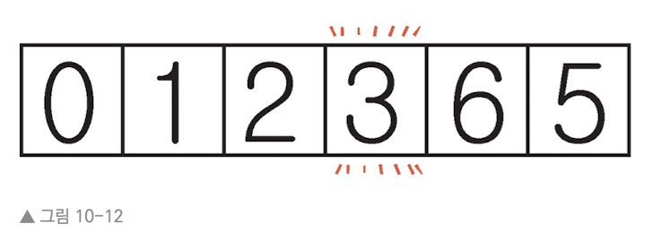

값 3이 피벗이었다. 피벗은 올바른 위치에 있으므로 피벗의 왼쪽과 오른쪽에 있는 하위 배열을 정리할 것이다. 

우선 왼쪽을 보자. 우연히 정리는 되어 있으나 컴퓨터는 이를 모른다. 

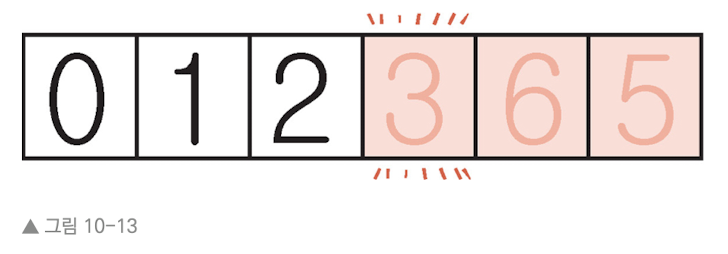

하위 배열 [0, 1, 2] 중에서 가장 오른쪽 원소를 피벗으로 잡을 것이다. 또한 왼쪽 포인터와 오른쪽 포인터를 설정한다.

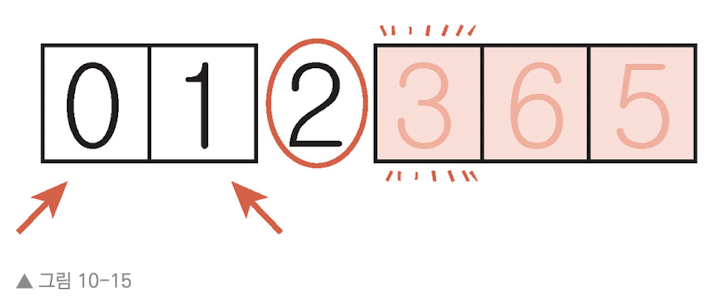

* 왼쪽 포인터(0)와 피벗(2): 0이 피벗보다 작으므로 왼쪽 포인터를 옮긴다. 오른쪽 포인터와 같은 위치에 자리잡게 된다.

* 왼쪽 포인터(1)과 피벗(2): 1이 피벗보다 작으므로 왼쪽 포인터를 오른쪽으로 옮기면 피벗을 가리키게 된다. 이때 왼쪽 포인터가 가리키는 값이 피벗과 동일하므로 왼쪽 포인터를 멈춘다.

* 이제 오른쪽 포인터를 동작시킨다. 오른쪽 포인터(1)과 피벗(2): 오른쪽 포인터가 피벗보다 작으므로 그대로 둔다.

* 왼쪽 포인터가 오른쪽 포인터를 지나쳤으므로 이번 분할에서는 더 이상 포인터를 이동시키지 않는다.

* 이제 피벗과 왼쪽 포인터의 값을 교환한다. 우연히 왼쪽 포인터가 피벗을 가리키게 됐으므로 결국 아무런 변화가 없다.

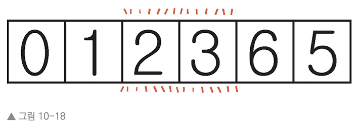

이제 피벗(2)는 올바른 위치에 놓여졌다.

이제 피벗(2)의 왼쪽에 있는 하위 배열 [0,1]을 살핀다. 피벗은 제일 오른쪽에 있는 값인 1로 두고, 왼쪽 포인터와 오른쪽 포인터를 설정한다.

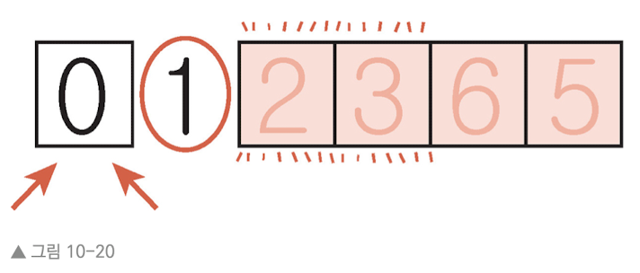

* 왼쪽 포인터(0)과 피벗(1): 0이 피벗보다 작으므로 왼쪽 포인터를 옮긴다. 피벗과 같은 위치에 자리 잡는다. 가리키는 값이 피벗과 동일하므로 포인터를 멈춘다.

* 오른쪽 포인터(0)와 피벗(1): 0이 피벗보다 작으므로 포인터를 그대로 둔다.

* 왼쪽 포인터가 오른쪽 포인터를 지나쳤으므로 이번 분할에서 더 이상 포인터를 움직이지 않는다.

* 왼쪽 포인터와 피벗을 교환한다. 동일하므로 결국 변화는 없다.

이제 피벗 (1)은 올바른 위치에 있고 분할도 끝난다. 맨 왼쪽에 원소가 하나(0) 남은 하위 배열은 기저 조건(원소가 0 또는 1개인 배열)이므로 아무것도 하지 않는다. 즉 자동으로 올바른 위치에 있다고 간주한다.

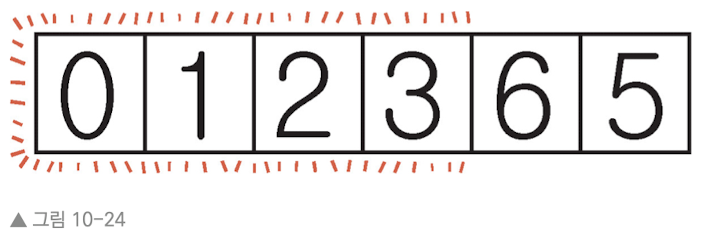

이제 3 오른쪽에 있는 배열을 마찬가지로 정렬한다.


---


## 10.3 퀵 정렬의 효율성
퀵 정렬의 효율성을 알기 위해서는 먼저 분할의 효율성을 알아야 한다. 분할은 두 가지 단계로 이루어져 있다.

* 비교: 각 값과 피벗을 비교한다.

* 교환: 적절한 때에 왼쪽과 오른쪽 포인터가 가리키는 값을 교환한다.

각 분할마다 배열 내의 각 원소를 피벗과 비교하므로 최소 N번 비교한다. 분할을 한 번 할 때마다 왼쪽과 오른쪽 포인터가 서로 만날 때까지 각 셀을 이동하기 때문이다. 

교환 횟수는 데이터가 얼마나 정렬돼 있는가에 따라 다르다. 각 분할마다 최소 한 번 교환하며, 가능한 값을 모두 교환한다 해도 왼쪽 반과 오른쪽 반에 있는 값을 교환하므로 한 분할에서 최대 N/2번 교환한다. 

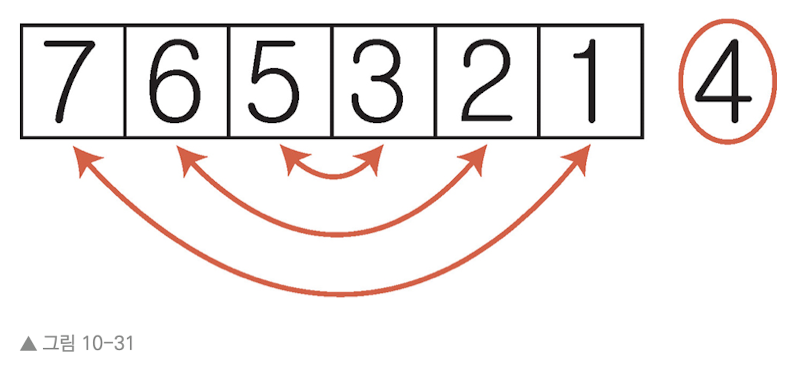

무작위로 정렬된 데이터가 있을 때, 대략 N/2의 반, 즉 N/4 정도 교환할 것이다. 따라서 비교 N번과 N/4를 합하면 대략 1.25N 단게가 걸린다.(O(N))

그러나 이는 한 번 분할할 때의 효율성이다. 퀵 정렬은 다양한 크기의 하위 배열에 여러 번 분할을 적용하므로 계산을 더 해야 한다. 다음은 8개 원소에 퀵 정렬을 적용한 것이다.

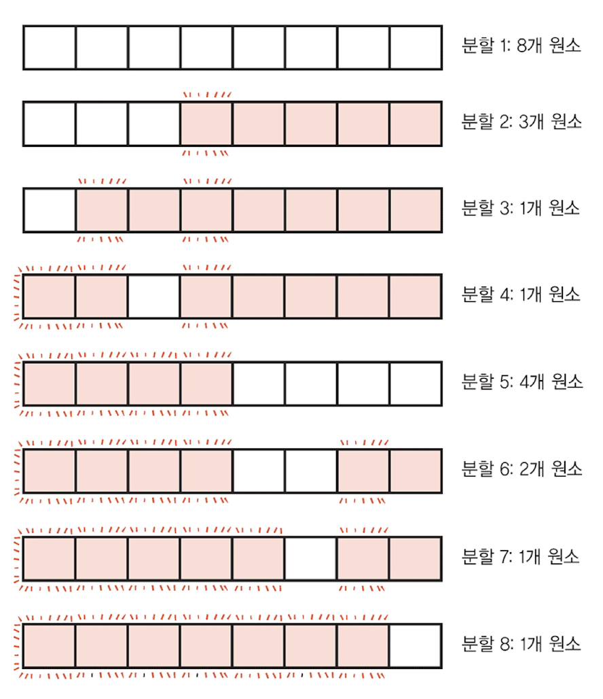

위는 8번 분할을 하지만, 분할마다 하위 배열의 크기가 다르다. 원소가 하나뿐인 하위 배열은 기저 조건이기 때문에, 효율성을 좌우하는 건 원소가 둘 이상인 하위 배열에서 일어나는 분할이다. 대략 각 분할에 1.25N 단계가 걸린다고 가정하면 결과는 아래와 같다.

* 8개 원소 * 1.25N = 10N
* 3개 원소 * 1.25N = 3.75N
* 4개 원소 * 1.25N = 5N
* 2개 원소 * 1.25N = 2.5N

모두 합치면 약 21단계이다.

배열의 크기가 다양하는 가정하에 분석하면 원소가 N개일 때 약 N * logN 단계임을 알 수 있다. 빅 오는 이를 O(NlogN)이라 표현한다.

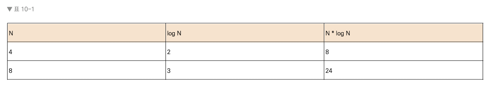

잘 보면 log가 나오는 것이 당연하다. 배열을 반으로 나누고 또 반으로 나뉜 것들을 반으로 나누고... 요컨대 원소가 한 개인 하위 배열이 될 때까지 각 하위 배열을 계속해서 반으로 나누기 때문이다. 원래의 배열을 같은 크기의 하위 배열로 logN 번 나눌 수 있고, 나눌 때마다 원래 배열의 N개 셀 전부를 분할해야 하므로 약 N * logN 단계이다.

지금까지 본 많은 알고리즘에서 최선의 경우는 배열이 이미 정렬됐을 때였지만, 퀵 정렬에서 **최선의 시나리오는 분할 후 피벗이 하위 배열의 한가운데 있을 때다.**


---


## 10.4 최악의 시나리오(퀵 정렬)
퀵 정렬에서 최악의 시나리오는 피벗이 항상 하위 배열의 정중앙이 아닌 한쪽 끝에 있을 때다.

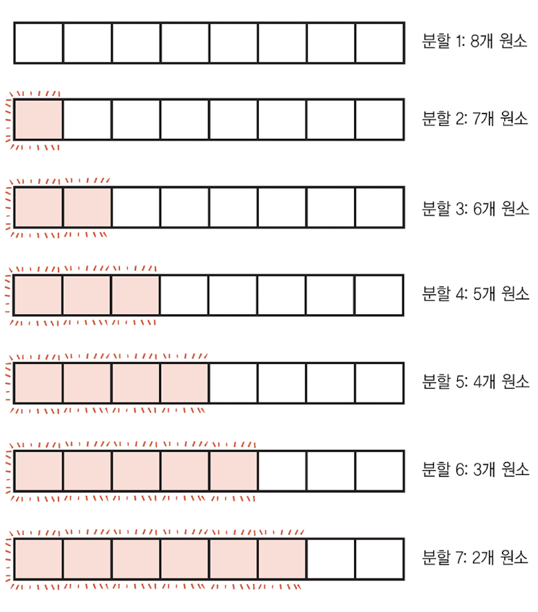

각 분할마다 교환은 한 번뿐이지만 비교가 너무 많으므로 손해다. 지금 최악의 시나리오에서 8 + 7 + 6 + 5 + 4 + 3 + 2개의 원소를 분할하고 총 35번 비교한다.

공식으로 보면 원소가 N개일 때 N + (N-1) + (N-2) + (N-3) ... + 2단계가 걸린다. 이 값은 약 $N^{2}/2$이다.

빅 오는 상수를 무시하므로 최악의 시나리오에서 퀵 정렬의 효율서은 O($N^2$)이다. 이를 삽입 정렬과 비교하면

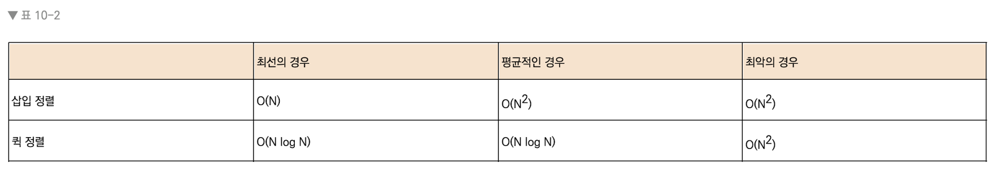

최악의 시나리오에서는 동일하고, 최선의 시나리오에서는 퀵 정렬보다 삽입 정렬이 더 빠르다. 하지만 퀵 정렬이 삽입 정렬보다 훨씬 우수한 까닭은 평균 시나리오, 다시 말해 대부분의 경우 일어나는 시나리오 때문이다.

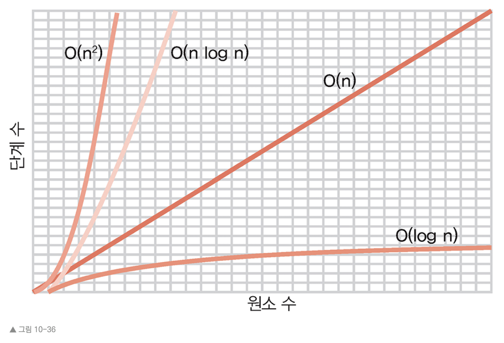


---


## 퀵 셀렉트
무작위로 정렬된 배열이 있을 때, 정렬은 안 해도 되지만 배열에서 열 번째로 작은 값, 혹은 열다섯 번째로 큰 값을 알고 싶다고 하자. 가령 수많은 시험 점수가 있을 때 25번째 백분위수나 중간 점수를 알고 싶다면 도움이 될 것이다.

퀵 정렬처럼 빠른 정렬 알고리즘을 사용한다고 해도 평균적으로 O(NlogN)이 걸린다. 나쁘진 않지만 퀵 셀렉트라 알려진 알고리즘이 훨씬 더 나은 성능을 낸다. 퀵 셀렉트도 분할에 기반하며, 퀵 정렬과 이진 검색의 하이브리드와 비슷하다.

값이 8개인 배열이 있을 때 이 배열 내에서 두 번째로 작은 값을 찾고 싶다고 하자.

먼저 전체 배열을 분할한다

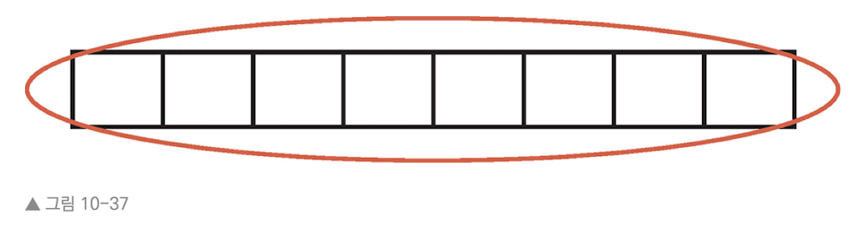

분할 후 피벗이 중간 위치에 있다고 하자

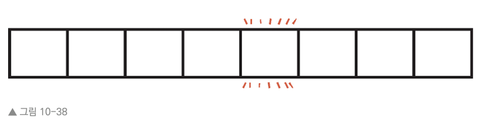

이제 피벗은 올바른 위치에 있고, 이 값은 배열 내에서 다섯 번째로 작은 값이기도 하다. 현재 두 번째로 작은 값을 찾고 있고 이는 피벗 왼쪽 어딘가에 있는 것이 확실하다. 따라서 왼쪽 하위 배열에서 분할 과정을 진행하면 알 수 있다.

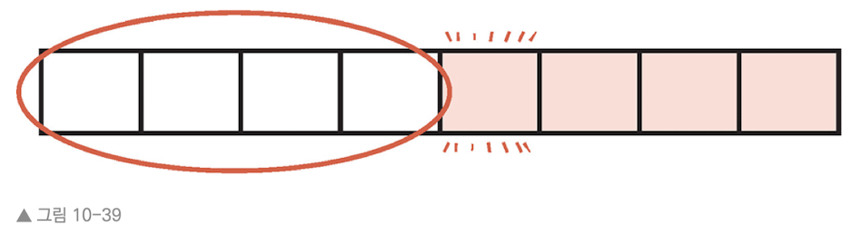

분할을 진행하면

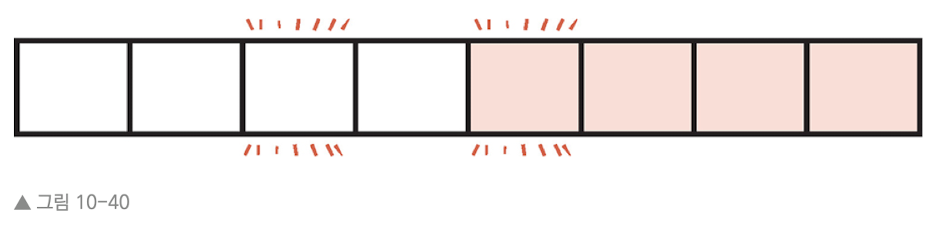

이제 세 번째 셀 값이 올바른 위치에 있으며, 세 번째로 작은 값이 무엇인지도 알게 되었다. 마무리로 왼쪽 하위 배열에 또 분할을 적용하면

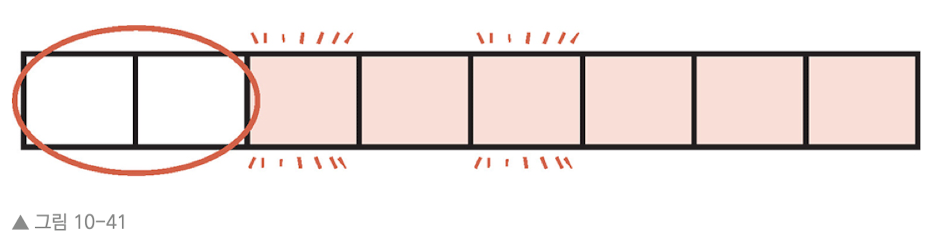

가장 작은 값과 두 번째로 작은 값이 올바른 위치에 자리 잡게 되고, 원하는 값을 알게 된다.

퀵 분할은 분할을 진행하면서 계속해서 남은 하위 배열을 분할해야 하므로 O(NlogN)이 걸린다. 하지만 퀵 셀렉트는 배열을 반으로 나눌 때마다 반쪽만 분석하면 된다. 평균 시나리오에서 퀵 셀렉트는 O(N)의 시간 효율성을 지닌다. 위 8개 원소로 이루어진 배열, 4개로 이루어진 배열, 2개로 이뤄진 배열에서 분할을 진행하였으므로 총 8 + 4 + 2 = 14 단계(약 2N)이다.

다음 코드는 SortableArray 클래스 안에 넣을 수 있는 quickselect! 메서드 구현이다.(quicksort! 메서드와 매우 유사하다.)

```Ruby
def quickselect!(kth_lowest_value, left_index, right_index)

    # 기저 조건이면, 즉 하위 배열에 셀이 하나면 찾고 있던 값을 찾은 것이다.
    if right_index - left_index <= 0
        return @array[left_index]
    end

    # 배열을 분할하고 피벗 위치를 가져온다.
    pivot_position = partition!(left_index, right_index)


    if kth_lowest_value < pivot_position
        quickselect!(kth_lowest_value, left_index, pivot_position - 1)


    elsif kth_lowest_value > pivot_position
        quickselect!(kth_lowest_value, pivot_position + 1, right_index)


    else # kth_lowest_value == pivot_position
         # 분할 후 피벗 위치가 k번째 작은 값과 같으면(정답이면)
        return @array[pivot_position]


    end

end
```

정렬되지 않은 배열에서 두 번째로 작은 값을 찾고 싶다면 다음 코드를 실행하면 된다.

```Ruby
array = [0, 50, 20, 10, 60, 30]

sortable_array = SortableArray.new(array)

p sortable_array.quickselect!(1, 0, array.length - 1)
```

quickselect! 메서드는 첫 번째 인자에 0에서 시작하는 인덱스 위치를 받는다. 두 번째로 작은 값을 원하면 1을 넘긴다.


---
