## 12.1 이진 트리
11장에서 단순 연결 리스트는 각 노드마다 그 노드와 다른 한 노드를 연결하는 링크를 포함했다. 트리 역시 노드 기반 자료 구조이지만, 트리의 각 노드를 여러 노드로의 링크를 포함할 수 있다.

다음 간단한 트리를 그림으로 표현한 것이다.

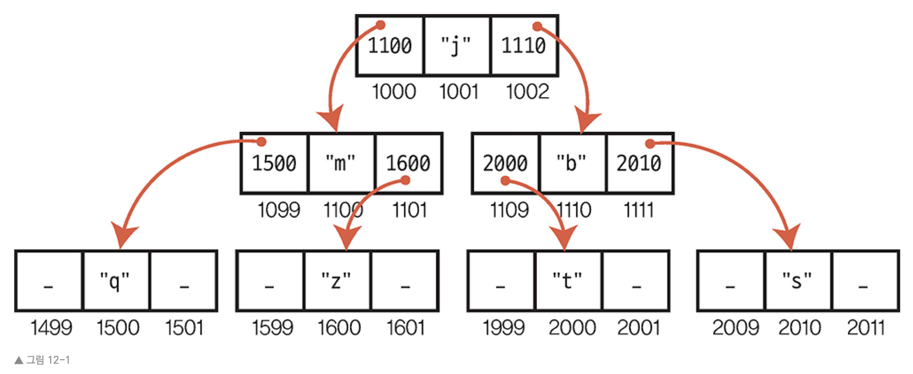

예제의 각 노드에는 다른 두 링크로 이어지는 링크가 있다. 간결하게 묘사한다면

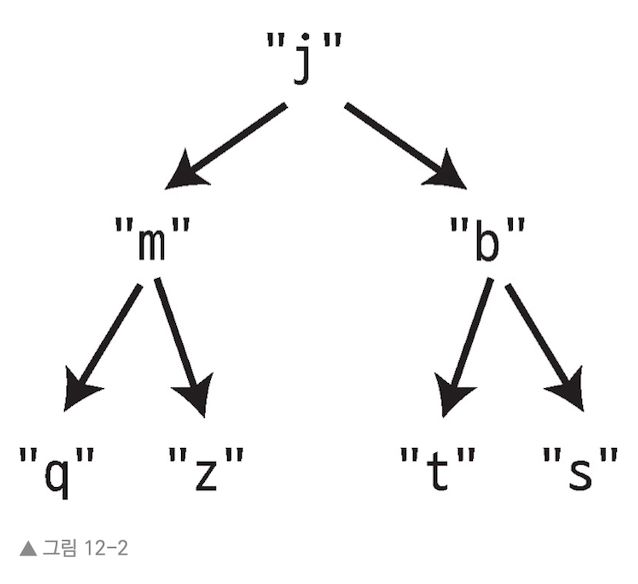

트리에는 세 가지 고유한 용어가 있다.

* 가장 상위 노드(예제에서는 "j")를 루트라 부른다.(위 그림에서 트리의 꼭대기다.)

* "j"를 "m"과 'b"의 부모라고 하고, 반대로 둘을 "j"의 자식이라고 한다. 동시에 "m"은 "q"와 "z"의 부모이다.

* 트리에는 레벨이 있다. 위 트리는 세 레벨이다.

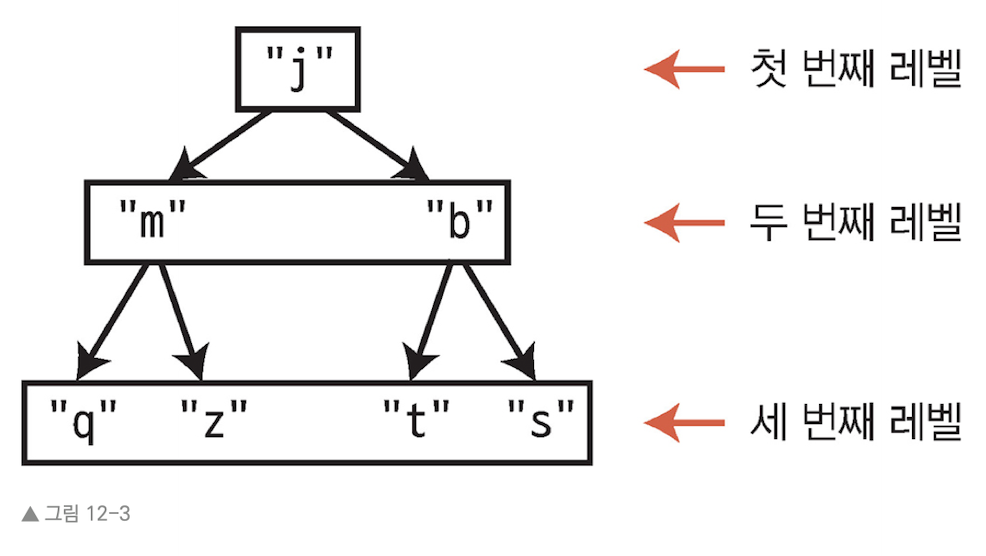

트리 기반 자료 구조는 종류가 다양하지만 12장에서는 이진 트리라 알려진 트리에 초점을 맞출 것이다. 이진 트리는 다음 규칙을 따르는 트리다.

* 각 노드의 자식은 0개나 1개, 2개다.

* 한 노드에 자식이 둘이면 한 자식은 부모보다 작은 값을, 다른 자식은 부모보다 큰 값을 가져야 한다.

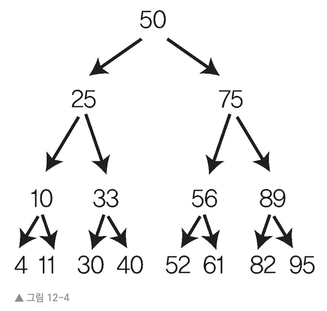

하나의 트리 노드를 파이썬으로 구현하면 다음과 같다.
```Python
class TreeNode:
    
    def __init__(self, val, left = None, right = None):

        self.value = val

        self.leftChild = left

        self.rightChild = right

```

이제 다음처럼 간단한 트리를 만들 수 있다.

```Python
# 자식이 될 노드 두 개를 생성
node = TreeNode(1)
node2 = TreeNode(10)

# 루트가 될 노드와 자식 둘을 합쳐서 트리를 생성
root = TreeNode(5, node, node2)

```


---


## 12.2
예제 이진 트리를 다시 보자

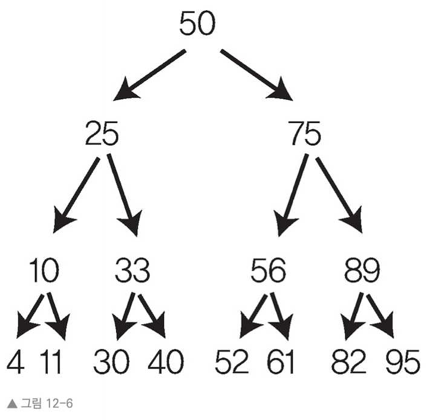

이진 트리를 검색하는 알고리즘은 루트 노드부터 시작한다.

1. 노드 값을 확인한다.

2. 찾고 있는 값이면 좋다!

3. 찾는 값이 현재 노드보다 작다면 왼쪽 하위 트리를 검색한다.

4. 반대로 찾는 값이 현재 노드보다 크면 오른쪽 하위 트리를 검색한다.

이를 파이썬으로 간단하고 재귀적으로 구현하면 다음과 같다.

```Python
def search(value, node):

    # 기저 조건: 노드가 없거나
    # 찾는 값이면
    if node is None or node.value == value:
        return node


    # 찾는 값이 현재 노드보다 작으면 왼쪽 자식을 검색한다.
    elif value < node.value
        return search(value, node.leftChild)


    # 찾는 값이 현재 노드보다 크면 오른쪽 자식을 검색한다.
    else: # value > node.value
        return search(value, node.rightChild)

```

이 과정을 그림을 따라가며 얼마나 많은 단계가 걸리는지 확인해보자

트리 검색은 반드시 루트부터 시작해야 한다. 검색하는 수는 61이라고 하자.

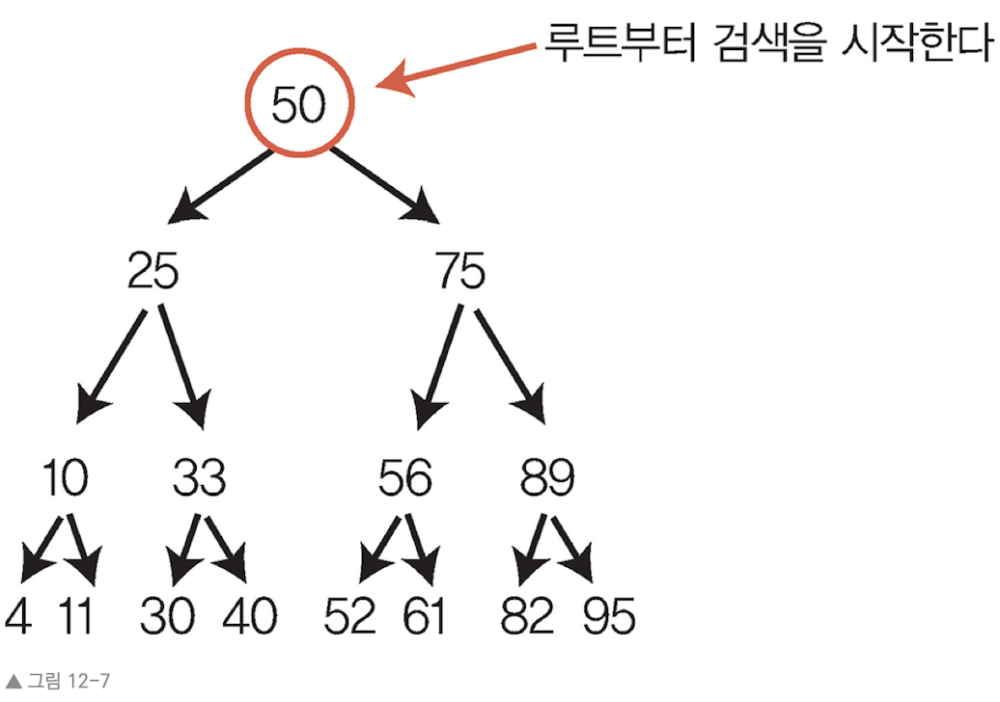

검색하는 수(61)이 노드 값(50)보다 크므로 오른쪽 자식을 검색한다.

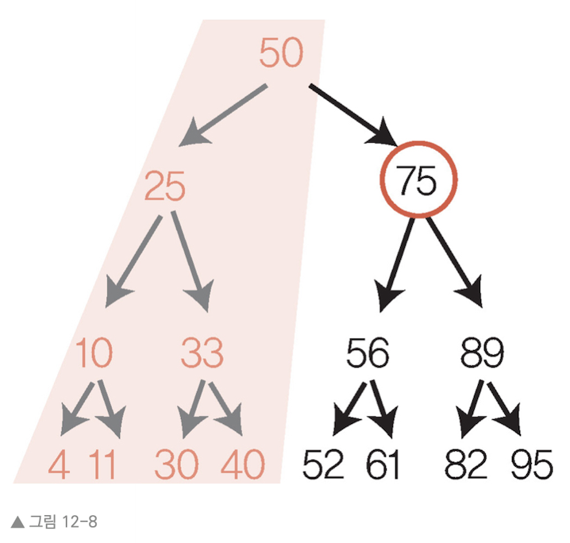

검색하는 수(61)이 노드 값(75)보다 작으므로 왼쪽 자식을 검색한다.

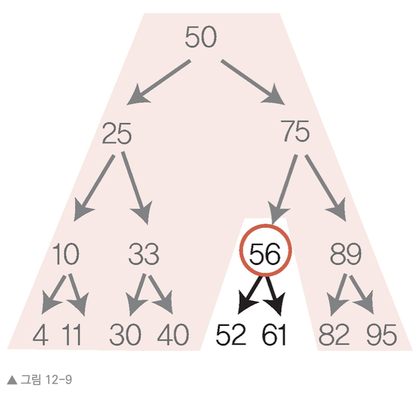

검색하는 수(61)이 노드 값(56)보다 크므로 오른쪽 자식을 검색한다.

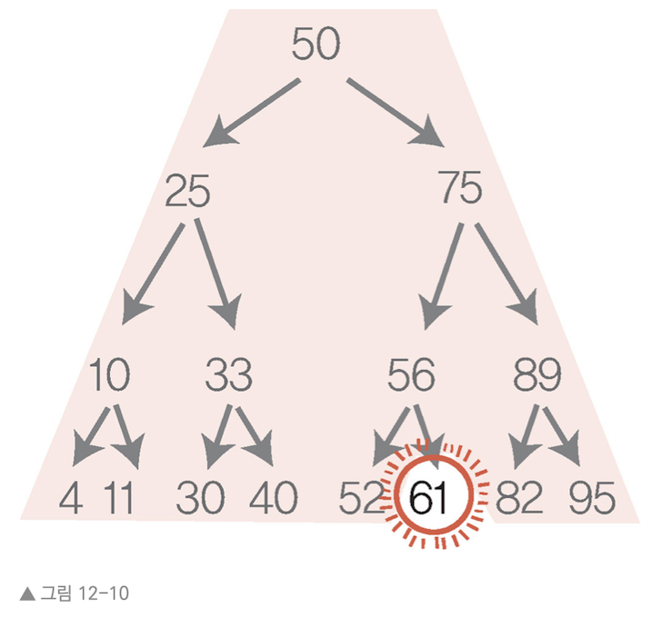

원하는 값을 찾는 데 4단계가 걸렸다.

보다 일반적으로 말하면 이진 트리 검색은 O(logN)이다. 각 단계를 수행할 때마다 값이 들어있을 남은 공간 중 반을 제거하기 때문이다.(물론 뒤이어 설명한 최선의 시나리오인 포화 균형 이진 트리에서만 그렇다.) 이는 정렬된 배열의 이진 검색과 효율성이 같다.

하지만 정렬된 배열보다 이진 트리가 정말로 뛰어난 연산은 삽입이다.


---


## 12.3 삽입
새 값을 이진 트리에 넣는 예제를 보자. 숫자 45를 아래 예제에 삽입할 것이다.

1. 첫 번째로 할 일은 45를 붙일 올바른 노드를 찾는 것이다. 검색은 루트부터 시작한다.

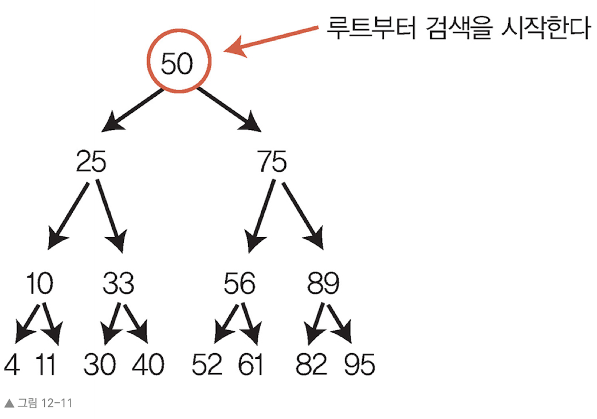

삽입할 수(45)는 노드 값(50)보다 작으므로 왼쪽 자식을 검색한다.

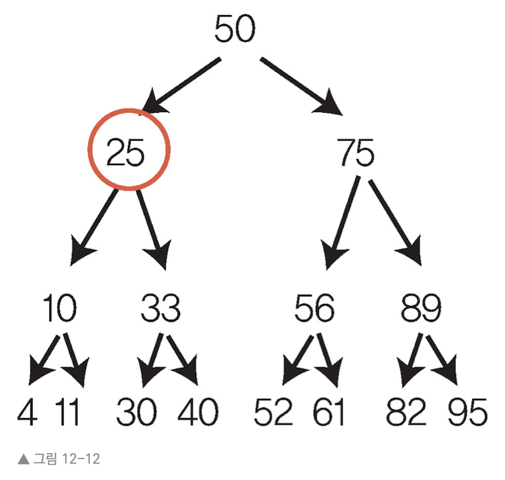

2. 삽입할 수(45)는 노드 값(25)보다 크므로 오른쪽 자식을 검색한다.

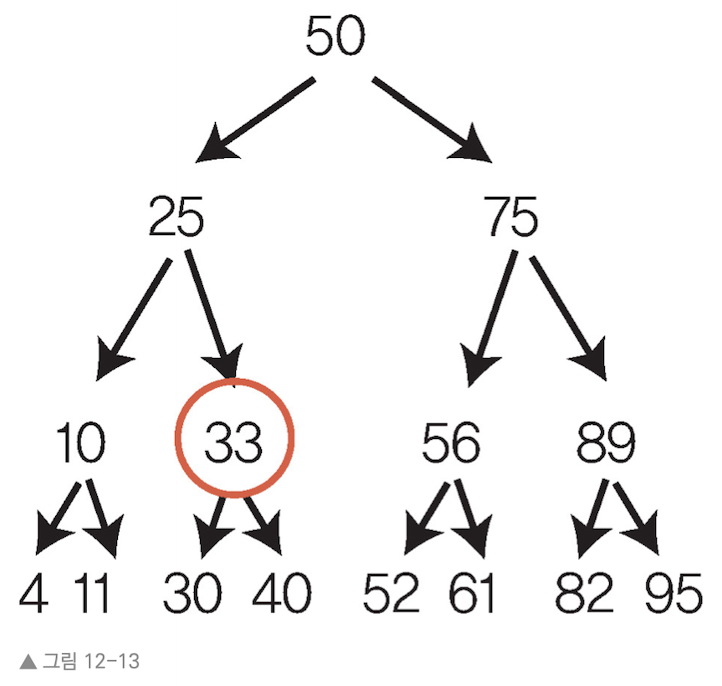

3. 삽입할 수(45)는 노드 값(33)보다 크므로 오른쪽 자식을 검색한다.

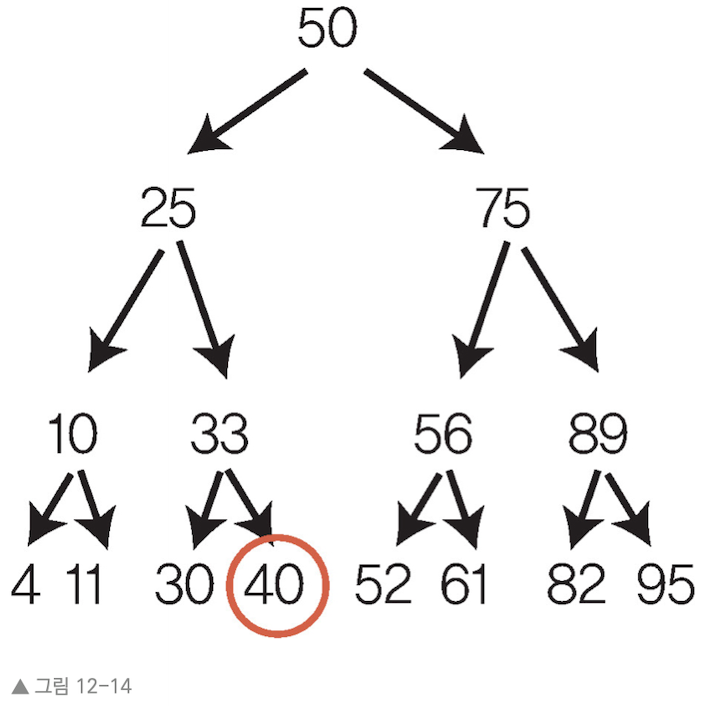

4. 노드 값은 40. 더 이상 자식이 없는 노드이므로 갈 곳이 없다. 즉, 삽입할 준비가 됐다.

5. 삽입할 수(45)는 노드 값(40)보다 크므로 오른쪽 자식 노드로 45를 삽입한다.

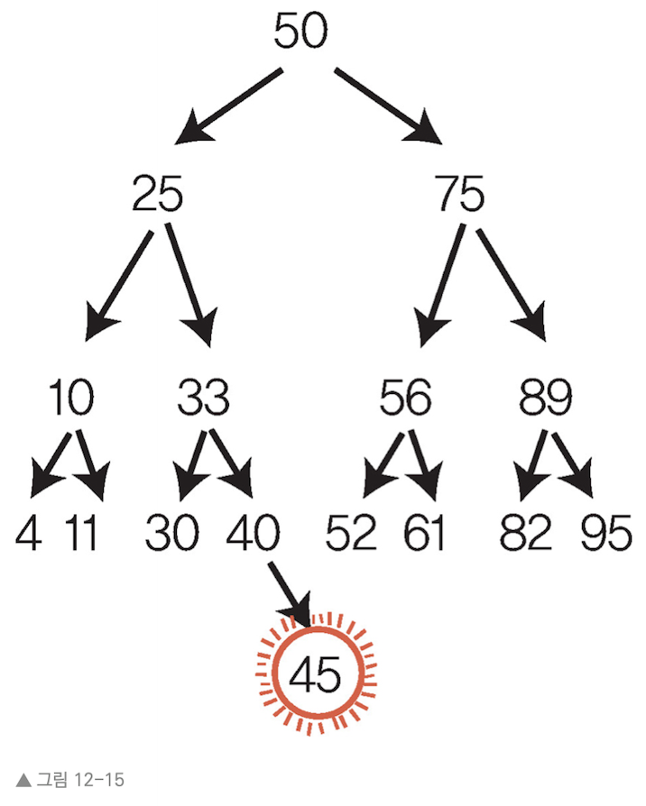

위 예제에서 삽입까지 5단계가 걸렸다. 검색 4단계와 삽입 1단계다. 삽입은 항상 검색에 한 단계가 추가된다. 즉 삽입은 logN + 1단계가 걸리며, 빅 오는 상수를 무시하므로 O(logN)이다.

이와 반대로 정렬된 배열에서는 검색뿐만 아니라 값을 삽입할 공간을 마련하기 위해 많은 데이터를 오른쪽으로 시프트해야 하기 때문에 삽입에 O(N)이 걸린다.

때문에 이진 트리가 매우 효과적이다. 정렬된 배열은 검색에 O(logN), 삽입에 O(N)이 걸리지만, 이진 트리는 검색과 삽입 모두 O(logN)이다. 데이터를 많이 변경할 애플리케이션이라면 특히 중요하다.

다음은 이진 트리에 값을 삽입하는 파이썬 구현이다.(재귀)

```Python
def insert(value, node):
    
    # 삽입하려는 값이 노드 값보다 작고
    if value < node.value:

        # 동시에 왼쪽 자식이 없으면 왼쪽 자식에 정해둔 값을 삽입한다.
        if node.leftChild is None:
            
            node.leftChild = TreeNode(value)

        # 왼쪽 자식이 있다면 왼쪽 자식으로 넘어가서 재귀를 진행한다.
        else:
            insert(value, node.leftChild)


    # 삽입하려는 값이 노드 값보다 크고
    elif value > node.value:

        # 동시에 오른쪽 자식이 없으면 오른쪽 자식에 정해둔 값을 삽입한다.
        if node.rightChild is None:
            
            node.rightChild = TreeNode(value)

        # 오른쪽 자식이 있다면 오른쪽 자식으로 넘어가서 재귀를 진행한다.
        else:
            insert(value, node.rightChild)

```

한 가지 알아둘 점은 무작위로 정렬된 데이터로 트리를 생성해야 대개 균형 잡힌 트리가 형성된다는 점이다. 예를 들어 데이터를 순서대로 1, 2, 3, 4, 5로 삽입하면 다음과 같은 트리가 생성될 것이다.


반면 3, 2, 4, 1, 5 순서로 삽입하면 균형 잡힌 트리가 된다.


이런 이유로 정렬된 배열을 이진 트리로 변환하고 싶다면 먼저 데이터 순서를 무작위로 만드는 것이 좋다.

살펴봤듯이 최악의 시나리오에서 불균형이 심한 트리의 검색은 O(N)이었다. 반면 최선의 시나리오인 완전히 균형 잡힌 트리 검색은 O(logN)이었다. 데이터를 무작위로 삽입한 일반적인 시나리오라면 균형이 꽤 잘 잡힌 트리일 것이며, 검색에는 약 O(logN)이 걸릴 것이다.


---


## 12.4 삭제
삭제는 이진 트리에서 가장 어려운 연산이며 주의 깊게 실행해야 한다.

다음 트리에서 4를 제거해보자.

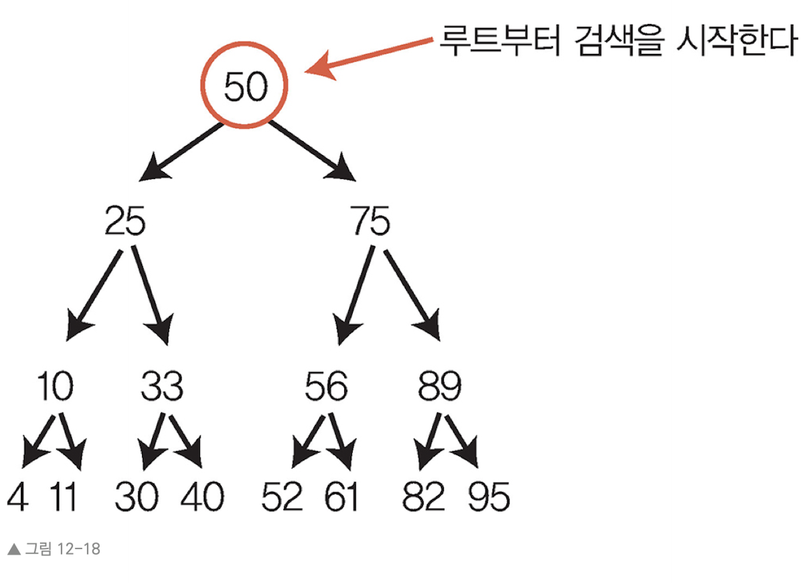

루트부터 검색을 시행한다. 4를 찾는 검색을 시행한 뒤 트리 맨 끝에서 한 단계로 4를 삭제하면 된다.

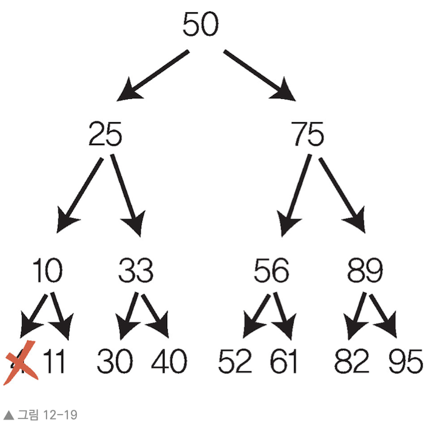

반면 10도 삭제하고 싶다고 하자. 다음과 같이 10을 삭제하면

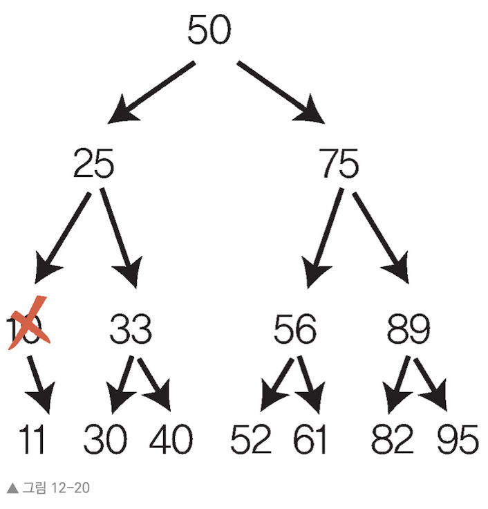

11이 트리와 연결이 끊긴다. 이 경우 10이 있던 자리에 11을 넣어 문제를 해결할 수 있다.

지금까지 배운 삭제 알고리즘은 다음과 같은 규칙을 따른다.

* 삭제할 노드에 자식이 없으면 그냥 삭제한다.

* 삭제할 노드에 자식이 하나만 있다면 노드를 삭제하고 대신 자식 노드를 그 자리에 넣는다.

그렇다면 자식이 둘인 노드를 삭제하는 복잡한 시나리오는 어떻게 할까?

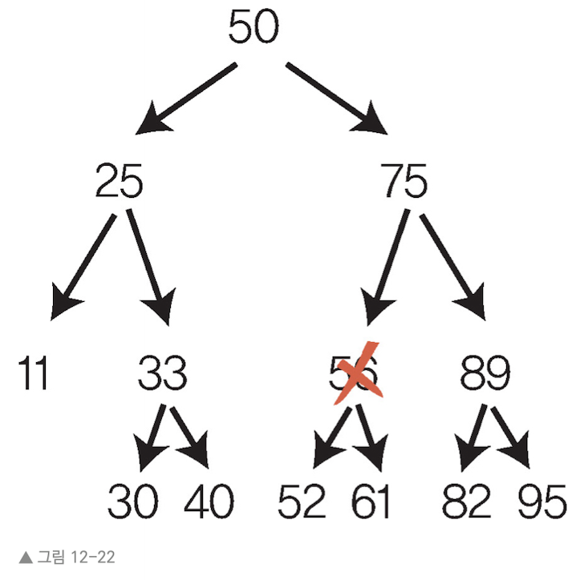

52와 61을 어떻게 해야 할까? 둘 다 56 위치에 놓을 수는 없다. 세 번째 삭제 알고리즘 규칙을 적용할 차례이다.

* 자식이 둘인 노드를 삭제할 때는 삭제된 노드를 후속자 노드로 대체한다. 후속자 노드란 **삭제된 노드보다 큰 값 중 최솟값을 갖는 자식 노드**다.

위 예제에서는 삭제된 56보다 크면서 최솟값인 61이 자리를 대체하게 된다.

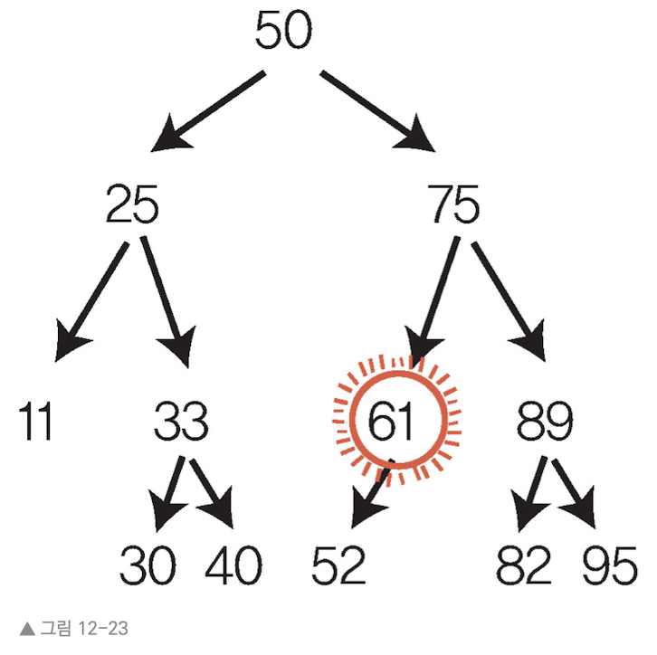

그렇다면 컴퓨터는 어떻게 후속자 값을 찾을까? 다음과 같은 알고리즘을 사용한다

삭제된 값의 오른쪽 자식을 방문하여 그 자식의 왼쪽 자식을 따라 계속 방문하면서 더 이상 왼쪽 자식이 없을 때까지 내려간다. 바닥 값이 바로 후속자 노드다.

좀 더 복잡한 예제로 실제 동작을 살펴 보자. 이번에는 루트 노드를 삭제할 것이다.

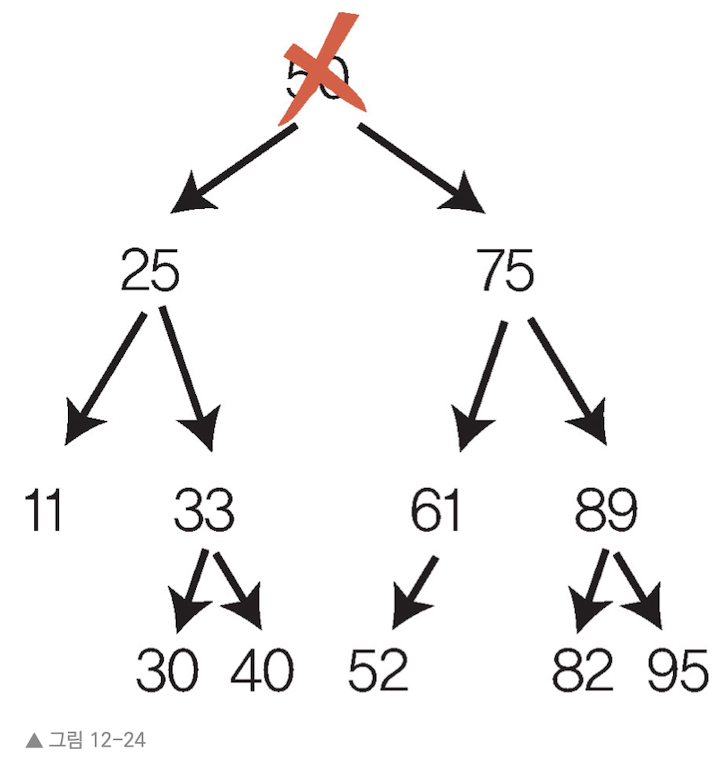

이제 루트 노드에 후속자 값을 넣어야 한다.

우선 오른쪽 자식을 방문 후 왼쪽 자식이 없는 노드가 나올 떄까지 왼쪽 방향으로 계속 내려간다.(삭제된 노드보다는 크면서 제일 작은 최솟값을 갖는다.)

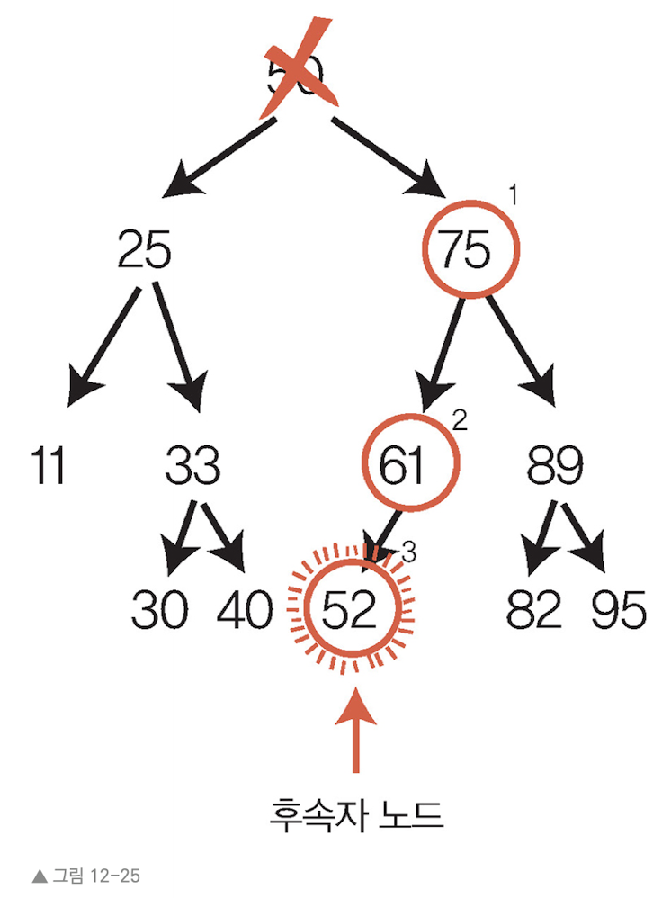

후속자 노드를 찾았으므로 52를 삭제된 노드 자리에 대체한다.

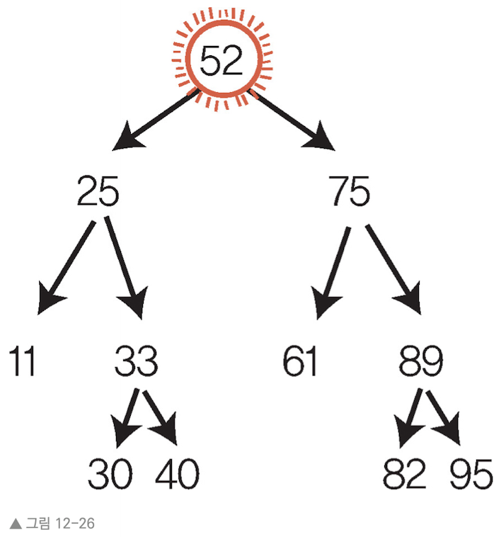

이렇게 완성이다.

하지만 아직 고려하지 않은 경우가 있는데 바로 후속자 노드가 오른쪽 자식을 가지고 있었을 경우다. 위 예제에서 후속자 노드에 오른쪽 자식을 추가한 경우를 보자

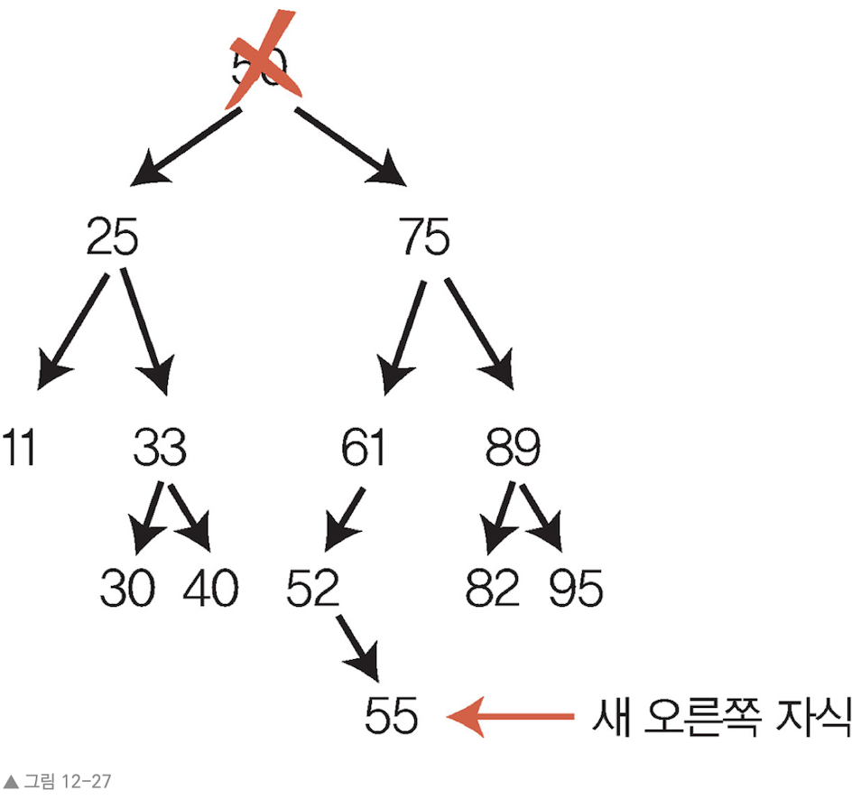

이때 후속자 노드인 52를 그냥 루트에 넣으면 자식 노드 55의 연결이 끊어진다. 따라서 삭제 알고리즘에는 규칙이 하나 더 있다.

* 만약 후속자 노드에 오른쪽 자식이 있다면, 후속자를 삭제된 노드가 있던 자리에 넣은 뒤, 후속자 노드의 오른쪽 자식을 원래 부모의 왼쪽 자식으로 대체한다.


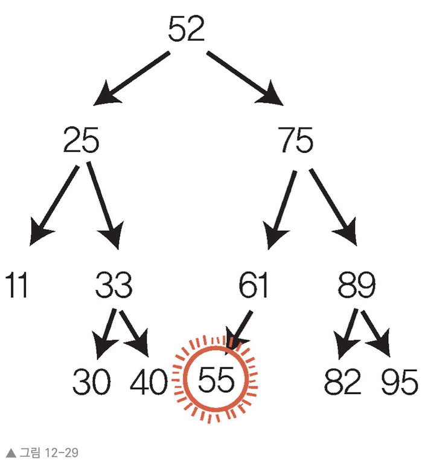

이렇게 완성한다. 아래는 이진 트리 삭제를 재귀적으로 구현한 것이다.

```Python
def delete(valueToDelete, node):


    # 트리 밑바닥에 도달해서 부모 노드에 자식이 없으면 기저 조건이다.
    # 아무 node도 반환하지 않아(자식 노드가 없어서) None이 되면 재귀는 끝난다.
    if node is None:
        return None


    # 삭제하려는 값이 현재 노드보다 작거나 크면
    # 삭제하려는 값을 트리에서 찾을 때까지
    # 현재 노드의 왼쪽 혹은 오른쪽 하위 트리에서 다시 삭제 함수를
    # 재귀적으로 시작한다.
    elif valueToDelete < node.value:
        node.leftChild = delete(valueToDelete, node.leftChild)
        return node

    elif valueToDelete > node.value:
        node.rightChild = delete(valueToDelete, node.rightChild)
        return node


    # 현재 노드가 삭제하려는 노드인 것을 확인했다면
    # 이제 대체할 값을 알아야 한다.(하위 노드가 없다면 그냥 삭제)
    elif valueToDelete == node.value:

        # 현재 삭제하려는 노드에 자식이 왼쪽 자식이 없다면,
        # 오른쪽 자식을 반환함으로써 삭제하고,
        # 그 부모의 새 하위 트리가 되도록 한다.
        if node.leftChild is None:
            return node.rightChild

        
        # 현재 삭제하려는 노드에 오른쪽 자식이 없다면
        # 왼쪽 자식을 반환함으로써 삭제하고
        # 그 부모의 새 하위 노드가 되도록 한다.
        elif node.rightChild is None:
            return node.leftChild


        # 왼쪽과 오른쪽 자식 모두 없었다면,
        # 첫 줄에 따라 None으로 끝날 것이다.


        # 현재 삭제하려는 노드가 왼쪽, 오른쪽 자식을 모두 가지고 있다면
        # 후속자 노드를 찾기 시작해야 한다.
        # 현재 노드(삭제하려는 노드)의 값을 후속자 노드로 대체하는 lift 함수를 호출한다.(밑에서 정의)
        else:
            node.rightChild = lift(node.rightChild, node)
            return node

    
    # 후속자 노드를 찾는 함수
    def lift(node, nodeToDelete):

        # 이 함수의 현재 노드에 왼쪽 자식이 있으면
        # 계속해서 왼쪽 하위 트리로 내려가도록 함수를 재귀적으로 호출하여
        # 후속자 노드를 찾는다.
        if node.leftChild:
            node.leftChild = lift(node.leftChild, nodeToDelete)
            return node

        # 현재 노드에 왼쪽 자식이 없으면
        # 현재 노드가 후속자 노드라는 뜻이다.
        # 후속자 노드를 삭제하려는 노드에 대체해서 넣는다
        
        else:
            nodeToDelete.value = node.value
            
            # 후속자 노드의 오른쪽 자식이 부모의 왼쪽 자식으로 쓰일 수 있도록 반환한다.
            return node.rightChild

```

검색과 삽입처럼 트리 삭제도 일반적으로 O(logN)이다. 삭제에는 검색 한 번과 연결이 끊긴 자식을 처리하는 단계가 추가로 필요하기 때문이다. O(N)이 걸리는 정렬된 배열 삭제와 대조적이다.


---


## 12.5 이진 트리 다뤄보기
이진 트리는 검색과 삽입, 삭제에서 O(logN)의 효율성을 자랑하므로 정렬된 데이터를 저장하고 조작해야 하는 시나리오에서 효율적인 선택이었다. 정렫된 배열은 데이터 검색이 이진 트리만큼 빠르지만, 이진 트리는 데이터 삽입과 삭제가 훨씬 빠르므로 데이터를 자주 수정할 경우 특히 효율적이다.

예를 들어 책 제목 리스트를 관리하는 애플리케이션을 생성한다고 하자. 애플리케이션에 다음과 같은 기능을 원한다.

* 프로그램은 책 제목을 알파벳순으로 출력할 수 있어야 한다.

* 프로그램은 리스트를 계속해서 바꿀 수 있어야 한다.

* 프로그램은 사용자가 리스트에서 제목을 검색할 수 있게 해야 한다.

책 리스트가 자주 바뀔 일이 없다면 정렬된 배열이 적절하다. 하지만 현재 만드는 앱은 실제로 많은 변경을 처리해야 할 것이므로, 리스트에 제목이 수백만 개라면 이진 트리를 사용하는 게 좋다.

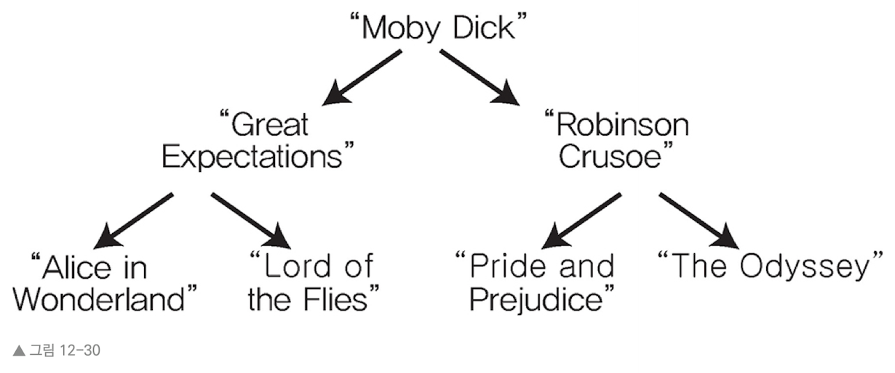

이진 트리에서 어떻게 데이터를 검색하고, 삽입하고, 삭제하는지 이미 다뤘다. 하지만 전체 책 제목 리스트를 알파벳순으로 출력하고 싶다면 어떻게 해야 할까?

* 트리의 노드를 모두 빠짐없이 방문할 수 있어야 한다. 자료 구조에서 모든 노드를 방문하는 과정을 자료 구조 순회라고 부른다.

* 리스트를 순서대로 출력할 수 있도록 트리를 알파벳 오름차순으로 순회할 수 있어야 한다. 트리를 순회하는 방법은 여러 가지인데, 이 애플리케이션에서는 중위 순회라 알려진 방법을 수행할 것이다.

재귀는 중위 순회를 수행하는 훌륭한 도구다. 노드에 호출한 traverse라는 재귀 함수를 생성하겠다. 함수는 다음과 같은 단계를 수행한다.

1. 노드에 왼쪽 자식이 있으면 그 자식에 traverse를 호출한다.(재귀 조건에 닿으면 제목을 출력)

2. 현재 노드를 방문한다.(예제인 책 제목 앱에서는 이 단계에서 노드의 값을 출력한다.)

3. 노드에 오른쪽 자식이 있으면 그 자식에 traverse를 호출한다. 다시 부모 노드를 방문한다.

기저 조건은 노드에 자식이 없을 때다. 단순히 노드의 제목을 출력할 뿐 traverse를 다시 호출하지 않는다. 

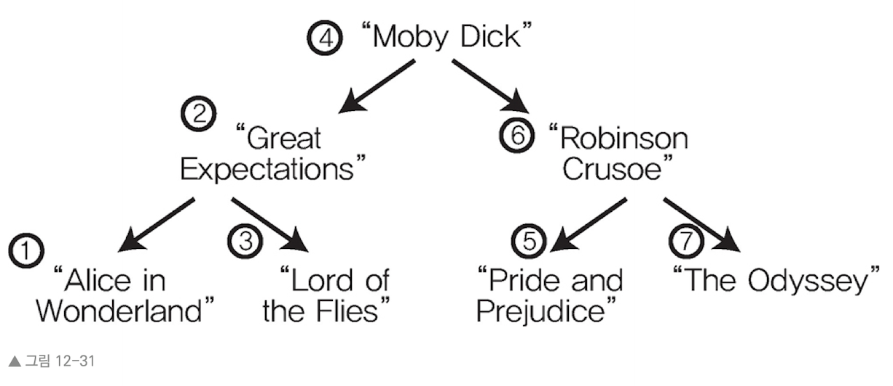

이렇게 책 제목 리스트를 알파벳 순으로 출력할 수 있다. 정의에 따르면 순회는 트리의 모든 노드를 방문하므로 트리 순회는 O(N)이 걸린다.

```Python
def traverse_and_print(node):

    # 기저 조건
    if node is None:
        return

    # 왼쪽 자식에 적용
    traverse_and_print(node.leftChild)
    
    print(node.value)
    
    traverse_and_print(node.rightChild)
```