## 13.1 그래프
그래프는 데이터가 어떻게 연결되는지 쉽게 이해할 수 있는 관계에 특화된 자료 구조이다.

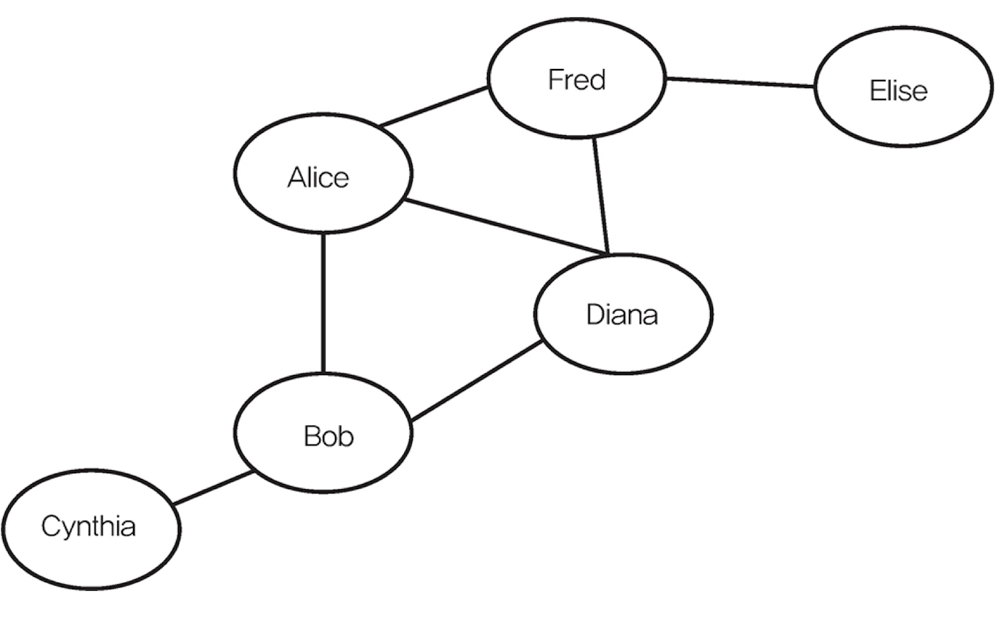

위는 친구 관계를 그래프 자료 구조로 표현한 예다. 한 사람은 노드로, 사람 간 관계는 각 선으로 표현한다. 그래프 용어로 **각 노드를 정점**이라 부르고, **각 선을 간선**이라 부른다.

그래프를 구현하는 방법은 다양하지만, 가장 간단한 방법은 해시 테이블을 사용하는 것이다. 아래는 루비로 구현한 예시다.

```Ruby
friends = {
    "Alice" => ["Bob", "Diana", "Fred"],
    "Bob" => ["Alice", "Cynthia", "Diana"],
    "Cynthia" => ["Bob"]
    "Diana" => ["Alice", "Bob", "Fred"],
    "Elice" => ["Fred"],
    "Fred" => ["Alice", "Diana", "Elise"]
}
```

해시 테이블의 모든 키(key) 값은 한 단계(O(1))로 찾을 수 있으므로 그래프를 쓰면 앨리스의 친구를 O(1)로 찾을 수 있다.

```Ruby
friends["Alice"]
```

페이스북과 달리 트위터는 관계가 상호적이지 않다. 즉 앨리스는 밥을 팔로우할 수 있지만, 밥이 반드시 앨리스를 팔로우하진 않는다. 

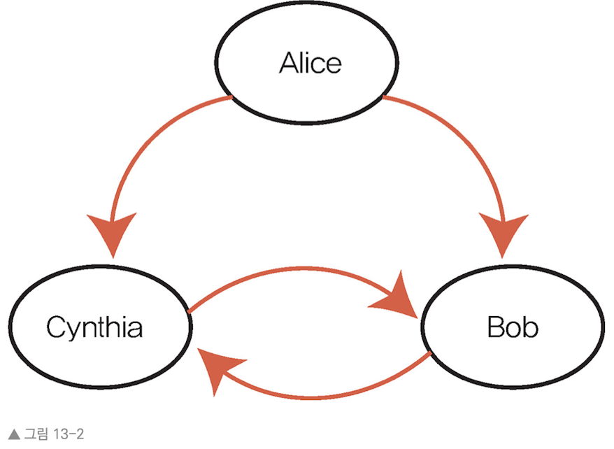

위 예제에서 화살표는 관계의 방향을 나타낸다. 앨리스는 밥과 신시아 둘 다 팔로우하지만, 누구도 앨리스를 팔로우하지 않는다. 밥과 신시아는 서로 팔로우한다.

```Ruby
follwees = {
    "Alice" => ["Bob", "Cynthia"],
    "Bob" => ["Cynthia"],
    "Cynthia" => ["Bob"]
}
```

트위터의 관계는 방향성이 있으므로 그림으로 표현할 때 화살표를 사용하고, 이러한 그래프를 방향 그래프라고 부른다.

반대로 페이스북은 관계가 상호적이고 단순 선을 사용하므로 그래프를 무방향 그래프라 부른다.

루비로 보다 강력한 그래프를 구현하면 다음과 같다.

```Ruby
class Person

    
    attr_accessor :name, :friends


    def initialize(name)
        
        @name = name
        @friends = []

    end


    def add_friend(friend)

        @friends << friend

    end

end
```

위 루비 클래스로 사람을 만들고 관계를 설정할 수 있다.

```Ruby
mary = Person.new("Mary")

peter = Person.net("Peter")

mary.add_friend(peter)

peter.add_friend(mary)

```


---


## 13.2 너비 우선 탐색

링크드인은 비즈니스 관계에 특화된 또 다른 인기 있는 소셜 네트워크다. 직접 네트워크 외 2차, 3차 커넥션을 정할 수 있는 부분이 잘 알려진 기능 중 하나다.

다음 그림에서 앨리스는 밥과 직접 커넥션이 있고, 밥은 신시아와 직접 커넥션이 있다. 하지만 앨리스는 신시아와 직접 커넥션이 없다. 신시아는 밥을 통해 앨리스와 연결되므로 신시아를 앨리스의 2차 커넥션이라고 한다.

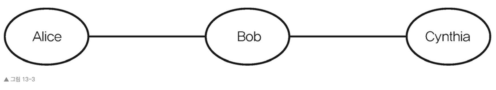

비직접적인 커넥션을 모두 포함해 앨리스의 전체 네트워크를 찾으려면 어떻게 시작해야 할까?

그래프를 순회하는 전형적인 방법은 두 가지다. 너비 우선 탐색과 깊이 우선 탐색이다. 이 책은 너비 우선 탐색만 살필 것이다.

너비 우선 탐색 알고리즘은 다음으로 처리할 정점을 추적하기 위해 큐를 사용한다. 최초의 큐는 시작점(예제는 앨리스)만 포함한다.

```
[Alice]
```

이어서 큐는 앨리스를 삭제하며 앨리스 정점을 처리한다. 앨리스 정점에는 "방문했음"이라고 표시하고, 이 정점을 현재의 정점으로 지정한다.

이어서 다음의 세 단계를 따른다.

1. 현재 정점과 인접한 각 정점을 방문한다. 이전에 방문한 적 없는 정점이면 "방문했음"을 표기하고 <U>큐에 추가</U>한다.(이 정점은 아직 현재 정점이 아니다.)

2. 현재 정점에 인접한 정점을 모두 방문했으면 큐에서 shift해서 현재 정점으로 만든다.

3. 현재 정점에 인접한 정점을 모두 방문했고, 동시에 큐에 더 이상 정점이 없으면 알고리즘을 종료한다.

실제로 어떻게 동작하는지 보자. 아래 그림은 앨리스의 링크드인 네트워크다. 앨리스가 현재 정점이며 인접한 정점이 선으로 이어져 있다. 또한 방문했다는 의미로 앨리스에게 체크 부호를 표시했다.

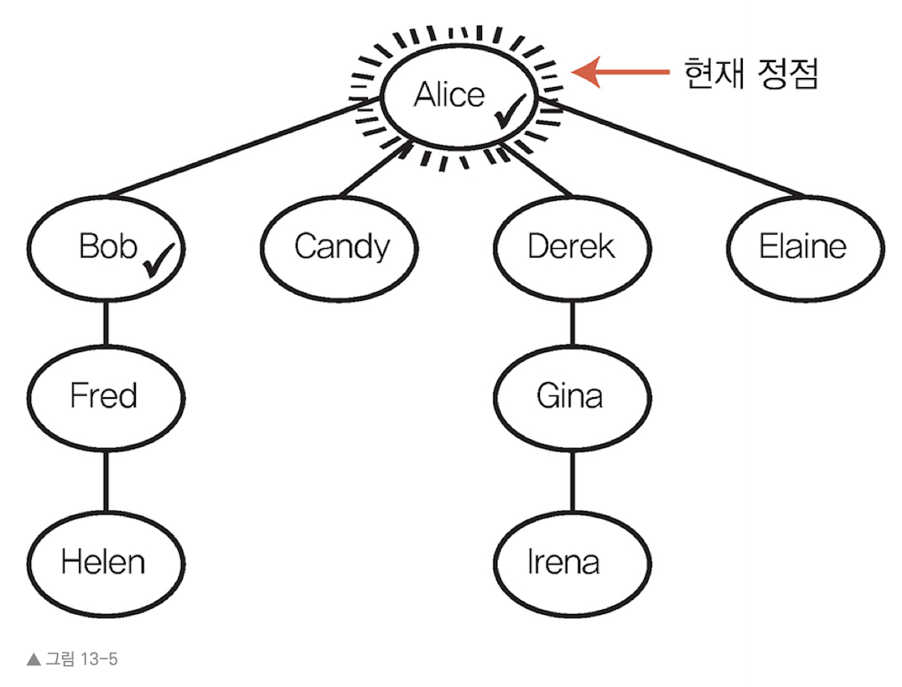

1. 인접한 정점을 방문한다. 밥을 방문 표시하고 큐에 추가한다. 따라서 이제 큐는 [Bob]이다. 이 말은 아직 밥은 현재 정점이 아니고 큐에 있을 뿐이다. 다음 인접한 정점인 캔디에 방문 표시를 하고 큐에 추가한다. 이제 큐는 [Bob, Candy]이다. 이렇게 계속 진행하면 큐는 [Bob, Candy, Derek, Elaine]이 된다.

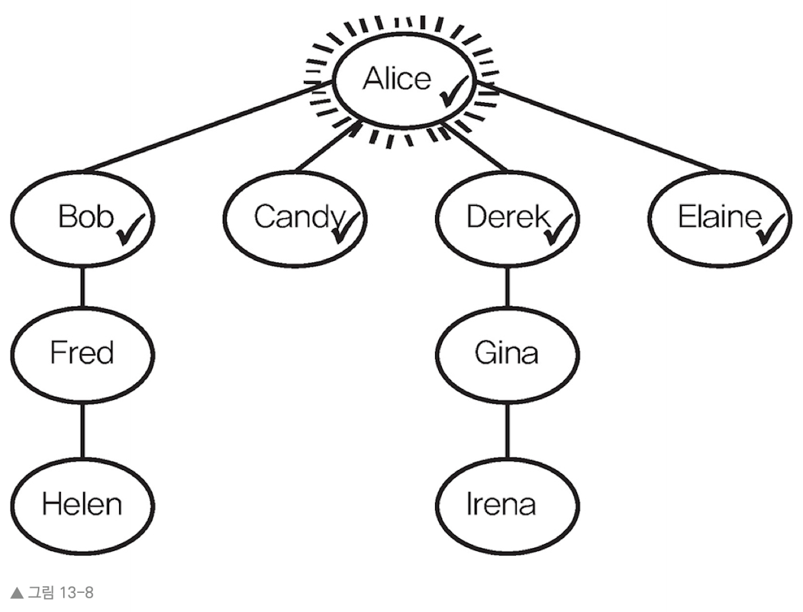

2. 현재 정점에 인접한 정점을 모두 방문했으므로 큐에서 맨 앞 데이터를 제거하며 현재 정점으로 가져온다.(여기서는 밥이다.)

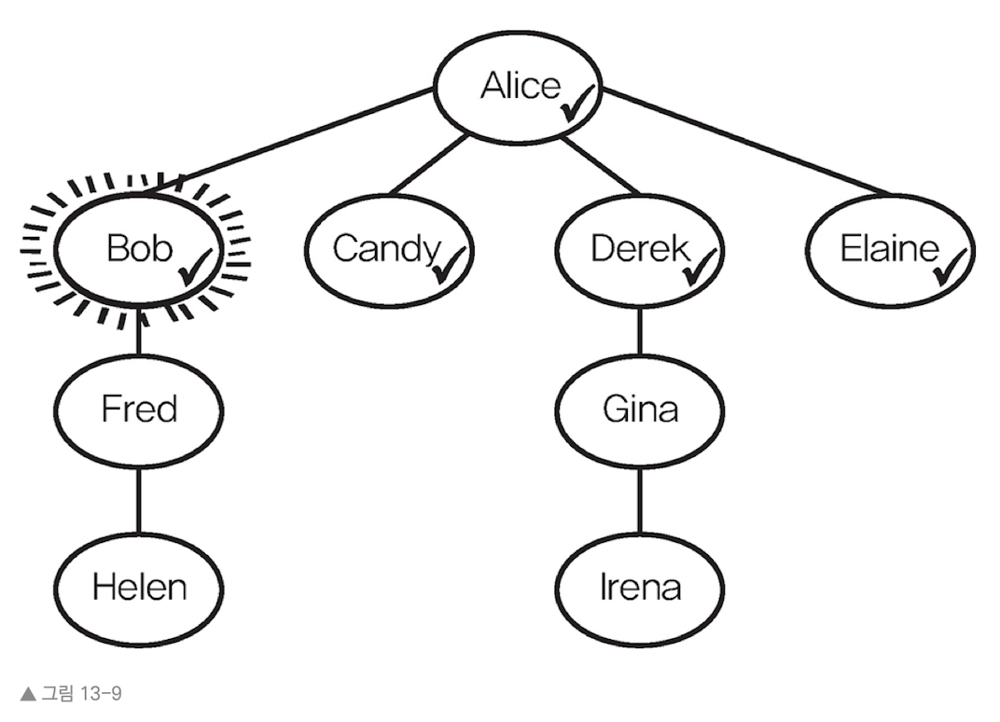

밥이 현재 정점이 됐으며 다시 첫 번째 규칙으로 돌아간다.

3. 인접한 정점을 방문하고 방문 표시+큐에 추가한다. 이제 큐는 [Candy, Derek, Elaine, Fred]다.

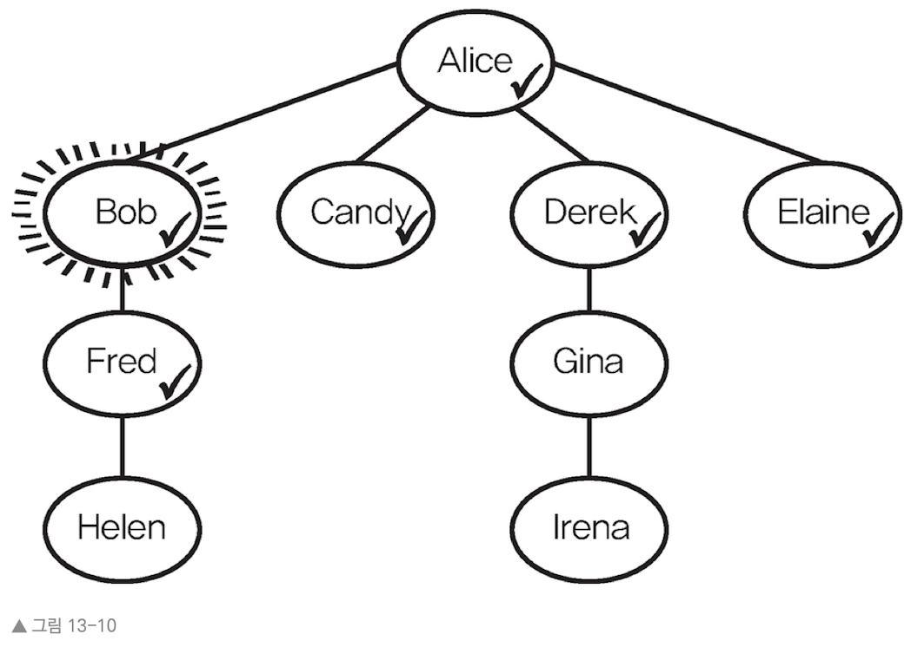

4. 현재 정점(밥)에 인접한 정점을 모두 방문했으므로 큐에서 맨 앞 데이터를 제거하며 현재 정점으로 가져온다.(여기서는 캔디다.)

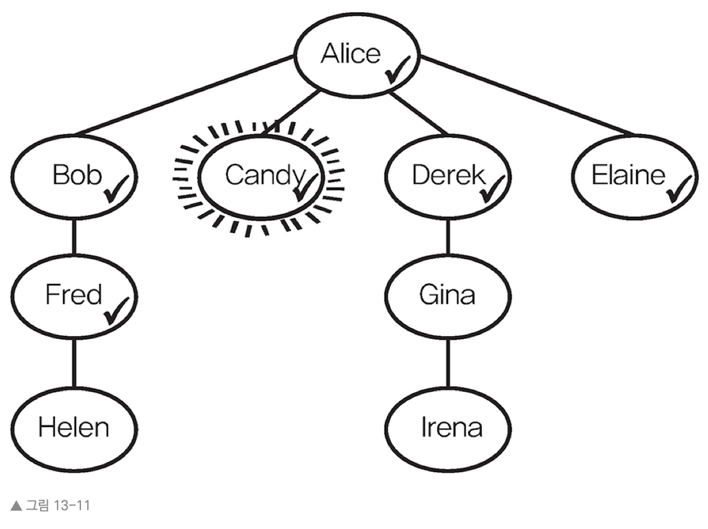

5. 하지만 캔디는 더 이상 방문하지 않은 인접 정점이 없다. 따라서 큐에서 다음 항목인 데릭을 가져온다. 이제 큐는 [Elaine, Fred]다.

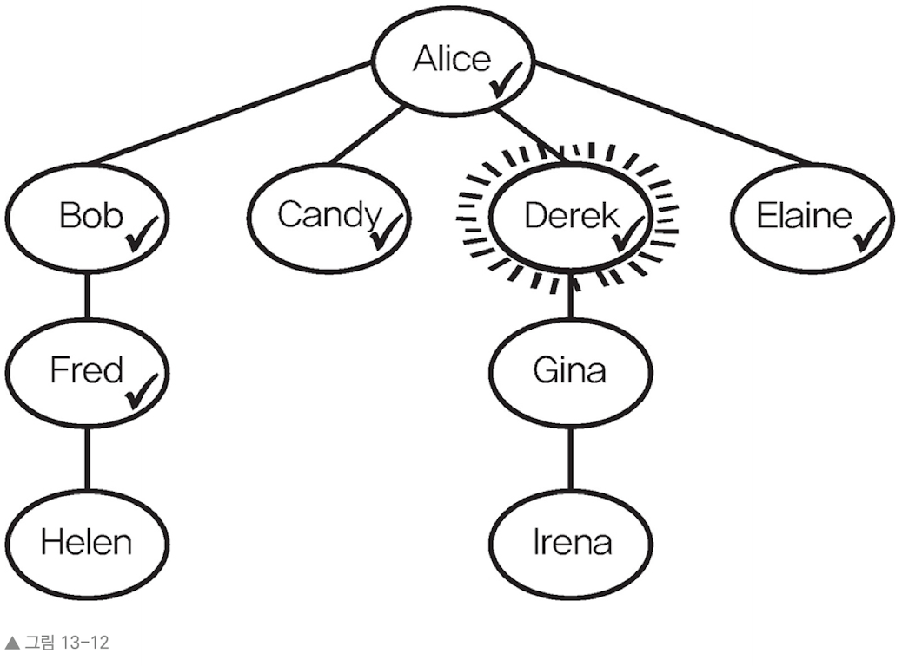

6. ...

이런 과정을 반복하여 순회를 마친다. 아래는 앞서 구현한 Person 클래스에 너비 우선 탐색을 사용해 한 사람의 전체 네트워크에 있는 이름을 표시하는 display_network 메서드를 구현할 것이다.

```Ruby
class Person

    
    attr_accessor :name, :friends


    def initialize(name)
        
        @name = name
        @friends = []

    end


    def add_friend(friend)

        @friends << friend

    end


    def display_network

        #방문한 노드를 모두 기록하여 알고리즘이 끝났을 때 이러한 노드들의 'visited' 속성을 다시 false로 할당하기 위해 쓸 수 있다.
        to_reset = [self]


        #큐를 생성한다. 처음에는 루트 정점을 포함한다.
        queue = [self]
        self.visited = true


        while queue.any?
        # 큐에서 제거(shift)한 정점이 현재 정점이다.

            current_vertex = queue.shift
            puts current_vertex.name

            #현재 정점의 인접 정점을 모두 큐에 추가한다.
            current_vertex.friends.each do |friend|

                if !friend.visited

                    to_reset << friend

                    queue << friend

                    friend.visited = ture

                end

            end

        end


        # 알고리즘이 끝나면 각 노드의 "visited" 속성을 false로 할당한다.
        to_reset.each fo |node|

            note.visited = false

        end

    end


end
```

올바른 동작을 위해 탐색에서 어떤 사람을 방문했는지 기록하는 "visited" 속성도 Person 클래스에 추가했다.

예제 그래프의 너비 우선 탐색은 다음과 같이 알고리즘 단계를 두 종류로 나눠서 효율성을 계산할 수 있다.

* 큐에서 정점을 삭제해 현재 정점으로 지정한다.

* 각 현재 정점마다 그 정점의 인접 정점을 각각 방문한다.

각 정점은 무조건 한 번씩 큐에서 삭제된다. 빅 오 표기법에서는 이를 O(V)라고 부른다. 즉, 그래프에 V개의 정점이 있을 때 큐에서 V번 삭제한다.

그런데 왜 단순히 정점 개수가 N일 때 O(N)이라고 표기하지 않을까? 위 알고리즘(과 여러 그래프 알고리즘)은 단순히 정점만 처리하는 것이 아니라 간선도 처리하는 단계를 포함하기 때문이다.

아래서 현재 정점이 각 인접 정점을 몇 번 방문하는지 알아볼 것이다. 예제는 밥이 현재 정점인 단계만 살펴본다.

```Ruby
current_vertex.friends.each do |friend|

    if !friend.visited

        to_reset << friend

        queue << friend

        friend.visited = true

    end

end
```

즉, 밥에 인접한 모든 정점을 방문한다. 이때 프레드뿐만 아니라 앨리스(원래 시작했던)도 방문한다. 앨리스 정점은 이미 방문했으므로 큐에 들어가지는 않지만 each 루프 단계에는 포함된다. 

너비 우선 탐색의 단계를 다시 주의 깊게 살펴보면, **인접한 정점에 방문하는 횟수**가 그래프에 있는 **간선 수의 두 배**이다. 모든 정점이 인접한 정점을 확인하는 과정을 거치기 때문이다. 따라서 간선이 E개라면 2E번 인접 정점을 확인한다. 빅 오 표기법으로 O(E)라고 한다.

즉 큐에서 제거하는 데 O(V), 방문하는 데 O(E)이므로 너비 우선 탐색의 효율성은 O(V + E)이다.


---


## 13.3 그래프 데이터베이스
그래프는 능수능란하게 관계를 처리하므로 소셜 네트워크 같은 데이터를 처리할 때 전통적인 데이터베이스보다 더 훌륭한 성능을 보인다. 

아래는 모두 연결된 다섯 명의 친구로 이뤄진 소셜 네트워크이다. 이들의 정보를 저장할 그래프 데이터베이스는 다음과 같다.


반대로 관계형 데이터베이스를 사용해 위 정보를 저장할 수도 있다. 이 경우 하나는 각 사용자의 개인 정보를 저장하고, 다른 하나는 친구들 간 관계를 저장할 것이다. 

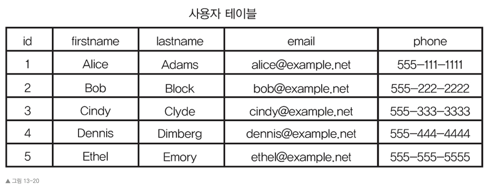

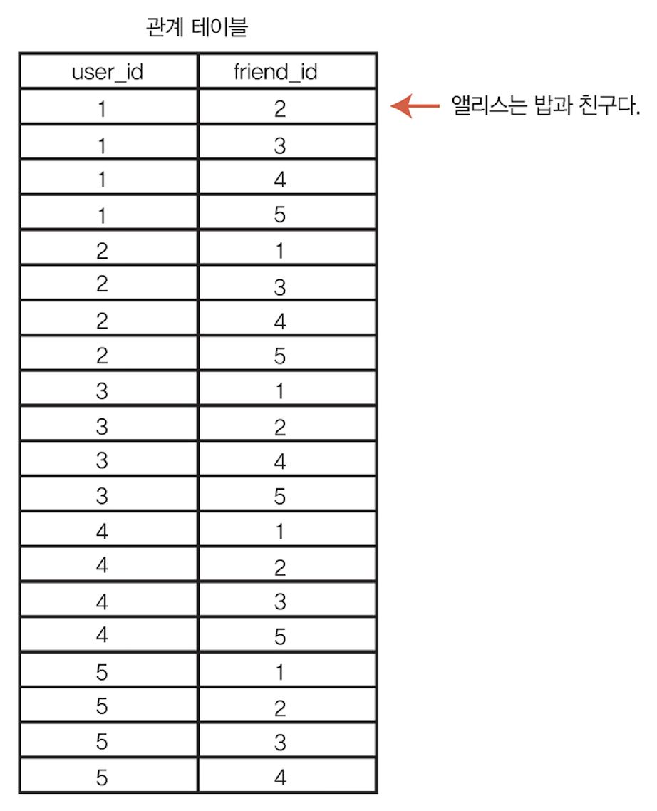


#### 관계형 데이터베이스의 경우

우선 관계형 데이터베이스가 어떻게 처리하는지 보자. 소셜 네트워크는 각 사용자가 친구의 모든 개인 정보를 볼 수 있다고 가정하고, 신디가 앨리스, 밥, 데니스, 에델에 대한 모든 정보(이메일 주소, 전화 번호)를 알고 싶다고 하자.

이 경우 관계형 데이터베이스는 신디의 ID부터 찾을 것이다.

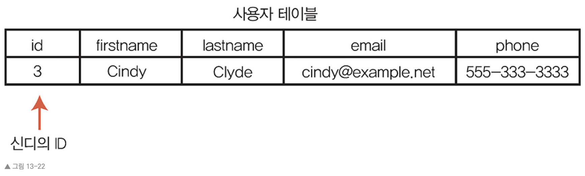

다음은 관계형 데이터 베이스에서 user_id가 3(신디의 ID)인 모든 줄을 찾는다. 이제 신디의 전체 친구 ID 리스트인 [1, 2, 4, 5]가 생긴다.

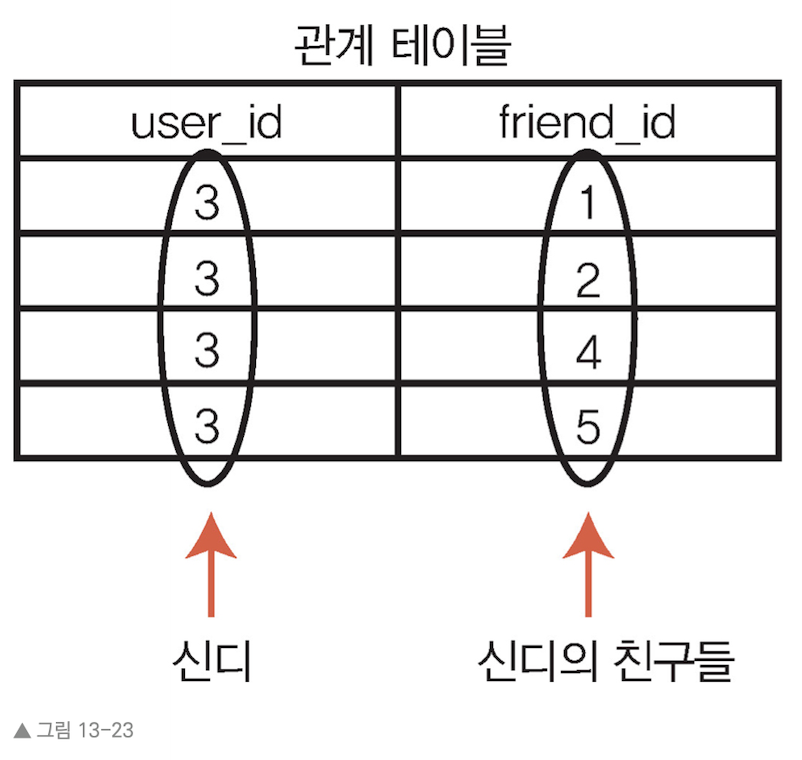

이 ID 리스트에서 다시 사용자 테이블에서 ID에 대응하는 각 줄을 검색한다. 컴퓨터 사용자 테이블에서 각 줄을 찾는 검색 속도는 대략 O(logN)이다. ID 순으로 정렬이 되어 있으며, 이진 검색을 사용하기 때문이다.(물론 어떻게 저장하는가, 어떤 알고리즘을 사용하는가에 따라 이야기는 달라진다.)

신디는 친구가 네 명이므로 검색만으로 O(4logN)의 과정을 수행한다. 보다 일반적으로 표현하면 친구가 M명일 때, 정보를 가져오는 효율성은 O(MlogN)이다. 


#### 그래프 데이터베이스의 경우

그래프 데이터베이스는 친구가 N명일 때, 데이터를 가져오는 데 O(N)단계가 걸린다. 데이터베이스에서 신디를 찾기만 하면 한 친구의 정보를 가져오는 데 딱 한 단계가 걸리기 때문이다. 신디의 경우 총 4단계가 걸린다.

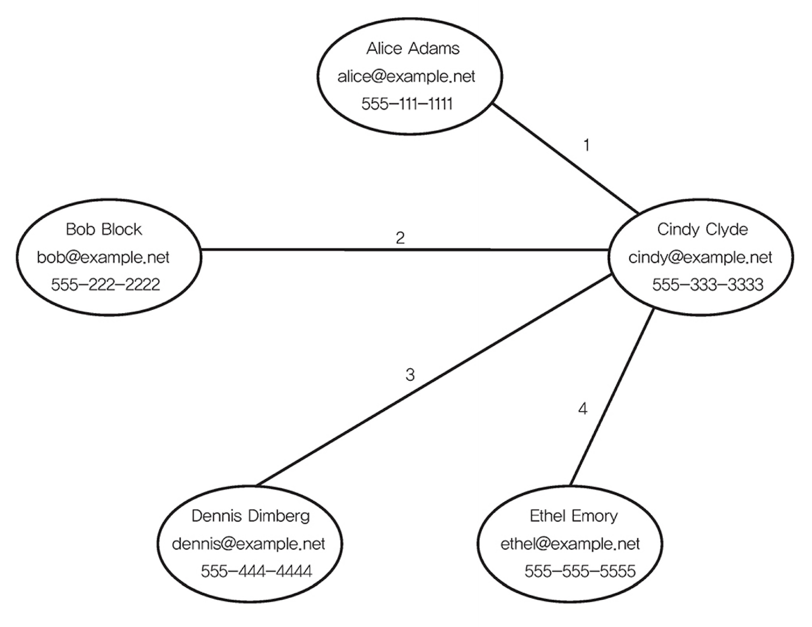


* 오픈 소스 데이터베이스 예제: Neo4j, 아랑고DB(ArangoDB), 아파치 지라프(Apache Giraph)

그래프 데이터베이스가 항상 주어진 애플리케이션을 위한 최적의 해결법은 아니다. 각 애플리케이션과 그 요구 사항을 주의 깊게 분석해야 한다.


---


#### 13.4 가중 그래프
또 다른 종류의 그래프로 가중 그래프가 있다. 가중 그래프는 일반 그래프와 비슷하지만 그래프의 간선에 추가 정보를 포함한다.

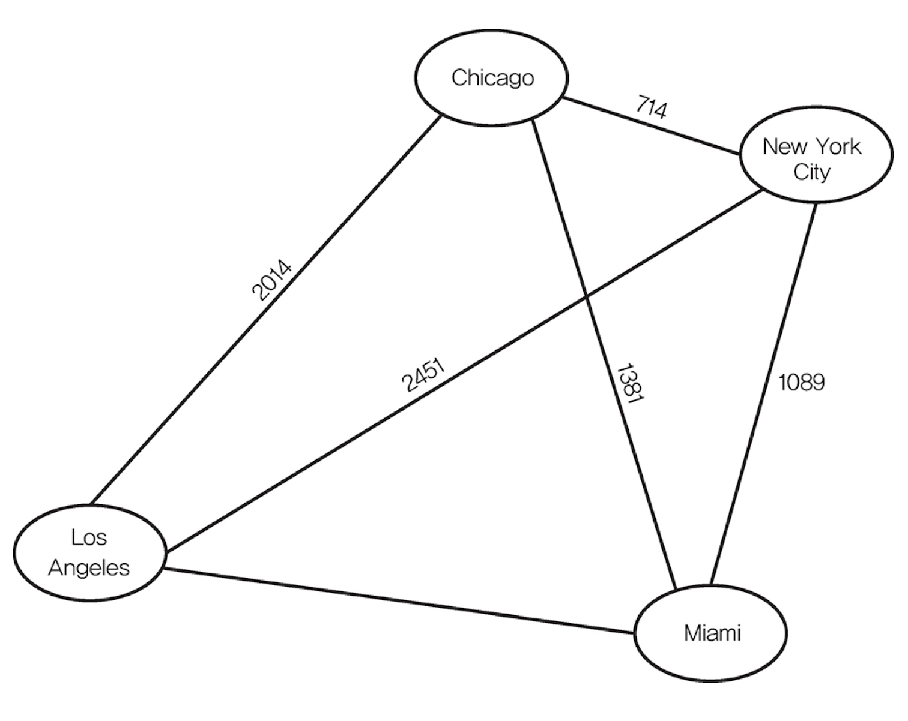

위 그래프의 각 간선에는 간선이 연결하는 도시 간 거리를 마일 단위로 표현한 숫자가 붙어 있다. 예를 들어 시카고와 뉴욕 간 거리는 714마일이다.

방향이 있는 가중 그래프도 가능하다. 다음 예제에서 댈러스에서 토론토로 가는 항공료는 138달러지만, 토론토에서 댈러스로 가는 항공료는 216달러이다.

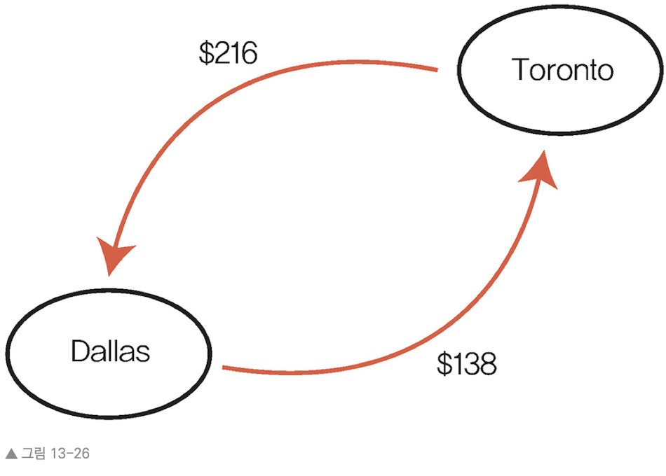

그래프에 가중치를 추가하려면 루비 구현을 상당히 수정해야 한다. 특히 배열 대신 해시 테이블을 사용해 인접 노드를 표현할 것이다.

```Ruby
class City

    attr_accessor :name, :routes


    def initialize(name)

        @name = name

        # 배열 대신 해시 테이블로 인접 정점을 표현한다.
        @routes = {}

    end


    def add_route(city, price)

        @routes[city] = price

    end

end
```

이제 도시와 가격이 붙은 경로를 생성할 수 있다.

```Ruby
dallas = City.new("Dallas")

toronto = City.new("Toronto")

dallas.add_route(Toronto, 138)

toronto.add_route(dallas, 216)
```

가중 그래프를 이용해 최단 경로 문제를 해결해 보자.

다음 그래프는 다섯 개 도시 간 가능한 항공료를 보여준다.

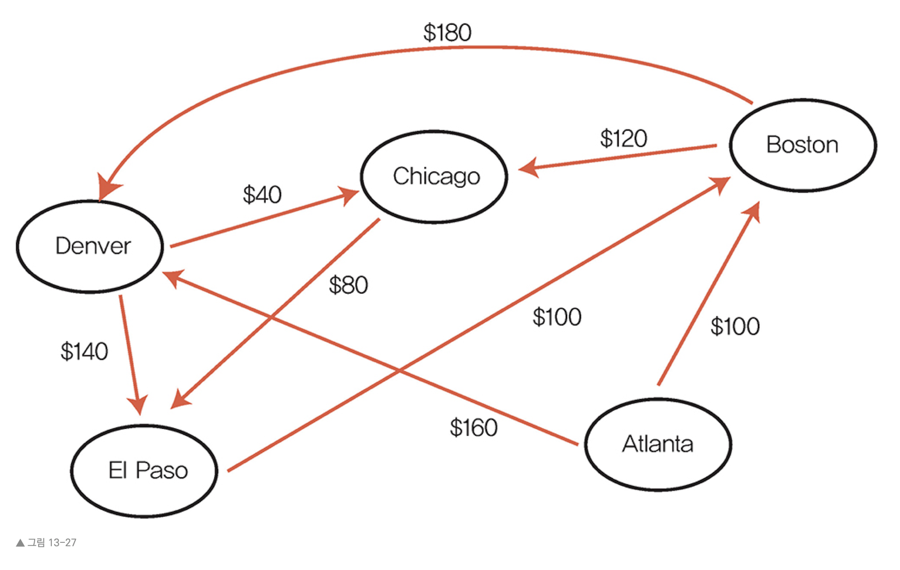

애틀란타에서 앨패소로 가고 싶다고 하자. 불행히도 직항은 없으며 다른 도시를 경유해서 가야 한다. 애틀란타에서 덴버를 경유해서 도착하며 300달러가 들지만, 애틀란타에서 덴바와 시카고를 경유해 도착하면 280달러면 된다. 이를 알고리즘으로 어떻게 구성할까?


---


## 13.5 데이크스트라의 알고리즘
에드거 데이크스트라라는 사람이 만든 최단 경로 문제를 푸는 알고리즘이다.(1959년 등장) 규칙은 다음과 같다.

1. 시작 정점을 현재 정점으로 한다.

2. 현재 정점에 인접한 모든 정점을 확인해서, 시작 정점해서 알려진 모든 위치까지의 가중치를 계산하고 기록한다.

3. 다음 현재 정점을 결정하려면 시작 정점에서 도달할 수 있는 "방문하지 않은" 가장 저렴한 알려진 정점을 찾는다.

4. 그래프 내 모든 정점을 방문할 때까지 1-3단계를 반복한다.

예제를 살펴보자. 우선 가중치를 계산하고 기록할 표를 마련할 것이다.


1. 먼저 시작 정점(애틀랜타)를 현재 정점으로 한다. 이때 알고리즘은 현재 정점과 바로 인접한 정점으로만 접근할 수 있다. 그림에서는 현재 정점에 주변선을 둘러싸서 표시하며, 한때 현재 정점이었던 곳은 체크 표시를 남길 것이다.

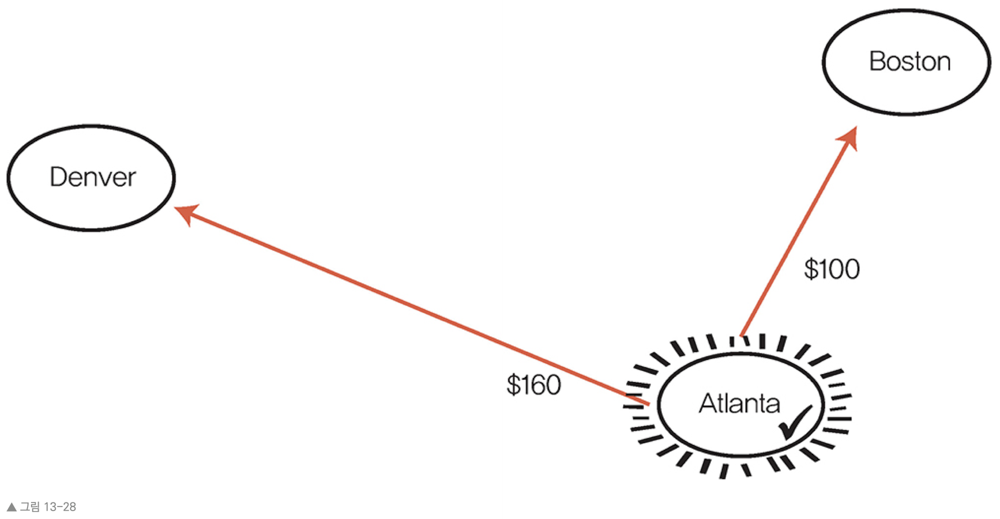

2. 인접한 모든 정점을 확인해서, 시작 정점(애틀란타)에서 갈 수 있는 모든 위치까지의 가중치를 기록한다. 

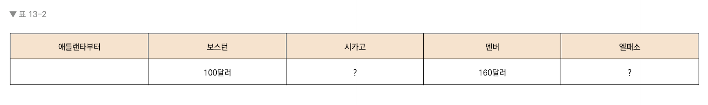

3. 다음 정점을 결정할 차례다. 시작 정점에서 갈 수 있는 방문하지 않은 가장 저렴한 정점인 보스턴을 현재 정점으로 한다. 

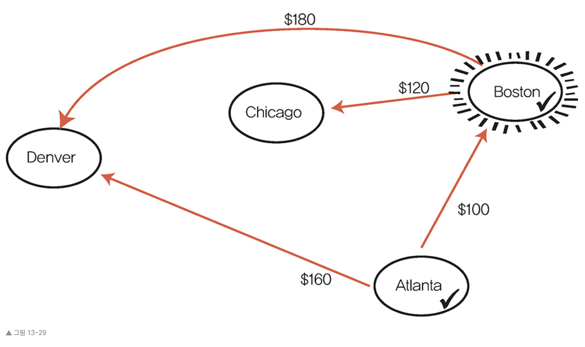

4. 보스턴에서도 인접한 모든 위치의 가중치를 기록한다. 이때 시작 정점인 애틀란타에서 보스턴을 경유해 갈 수 있는 모든 위치까지의 가중치를 기록한다.

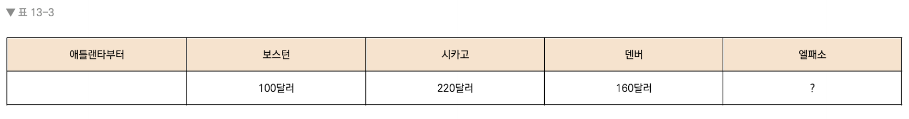

이때 보스턴에서 덴버로 가는 경로가 있지만, 기존 2번에서 표를 업데이트(애틀란타->덴버)할 때 160달러면 갈 수 있었다. 하지만 보스턴을 경유해 덴버로 간다면 280달러가 소요된다. 표에는 가장 저렴한 경로만 기록하므로 표를 업데이트하지 않는다.

5. 현재 정점에서 갈 수 있는 모든 경로를 알아봤으므로 이제 시작 정점에서 갈 수 있는 가장 저렴한 "방문하지 않은" 정점을 시작 정점으로 한다. 보스턴은 방문했으므로 이제 표에서 제일 저렴한 정점은 "덴버"이므로 덴버를 시작 정점으로 삼는다.

시카고 루트가 200달러로 더 저렴하므로 업데이트한다. 또한 덴버에서 엘패소로 갈 수 있는 루트가 있으므로 업데이트한다.(300달러)

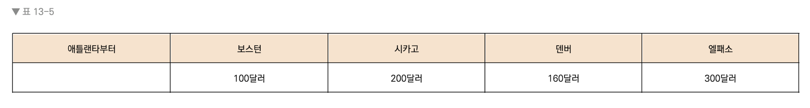

6. 이제 방문하지 않은 정점(시카고, 엘페소) 중 제일 저렴한 시카고를 시작 정점으로 삼고 과정을 반복한다.

시카고에서 떠날 수 있는 비행기는 딱 하나로 엘패소가 있다.(총 280달러) 더 저렴하므로 업데이트 한다.

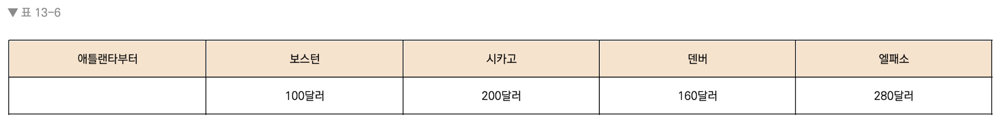

7. 마지막으로 남은 "방문하지 않은" 정점 엘패소를 시작 정점으로 삼는다. 엘패소에서 떠나는 경로는 딱 하나로 보스턴으로 가는 100달러짜리 비행이다. 이는 더 저렴한 경로에 사용할 수 없으므로 표를 수정할 필요가 없다. 알고리즘은 종료됐고 표는 애틀란타에서 다른 도시로 가는 가장 저렴한 가격을 알려준다.

데이크스트라의 알고리즘을 루비로 구현하면 다음과 같다. 우선 해시 테이블을 이용해 그래프 데이터베이스를 만든다.

```Ruby
class City

    attr_accessor :name, :routes


    def initialize(name)

        @name = name

        # 배열 대신 해시 테이브롤 인접 정점을 표현한다.
        # 예를 들면 {boston => 100, denver => 160}
        @routes = {}

    end


    def add_route(city, price_info)

        @routes[city] = price_info

    end


end
```

add_route 메서드를 사용해 예제에 나오는 도시를 할당한다.

```Ruby
atlanta = City.new("Atlanta")

boston = atlanta = City.new("Boston")

chicago = atlanta = City.new("Chicago")

denver = atlanta = City.new("Denver")

el_paso = atlanta = City.new("El Paso")

atlanta.add_route(boston, 100)

atlanta.add_route(denver, 160)

boston.add_route(chicago, 120)

boston.add_route(denver, 180)

chicago.add_route(el_paso, 80)

denver.add_route(chicago, 40)

denver.add_route(el_paso, 140)
```

아래 데이크스트라의 알고리즘 코드는 다소 복잡하다.

```Ruby
def dijkastra(starting_city, other_cities)


    # routes_from_city 해시 테이블
    # 주어진 도시에서 다른 모든 도시까지 가는 모든 price_infos 데이터와
    # 도착지까지 가는 데 거치는 도시 데이터를 가진다.
    routes_from_city = {}

    # 위 데이터의 포맷은 다음과 같다.
    # {도시 => [가격, 원래 도시에서 경로 중 이 도시 바로 전에 들리는 도시]}

    # 예제에서 데이터는 다음과 같은 결과가 될 것이다.
    # {atlanta => [0, nil], boston => [100, atlanta], chicago => [200, denver], denver => [160, atlanta], el_paso => [280, chicago]}


    # 시작 도시에서 시작 도시로 가는 비용은 0이다.
    routes_from_city[starting_city] = [0, starting_city]


    # 시작 도시 외 다른 도시까지 가는 비용과 경로는 아직 알지 못하므로
    # 데이터 초기화는 모두 무한대 값을 할당한다.(작은 값이 계속 기록되므로 무한대로)
    other_cities.each do |city|

        routes_from_city[city] = [Float::INFINITY, nil]

    end

    #예제의 초기 데이터는 다음과 같다.
    # {atlanta => [0, nil], boston => [Float::INFINITY, nil], chicago => [Float::INFINITY, nil], denver = [Float::INFINITY, nil], el_passo => [Float::INFINITY, nil]}


    # "방문했던" 도시를 기록할 배열
    visited_cities = []


    # 우선 시작 도시를 현재 도시(애틀란타)로 한다.
    current_city = starting_city


    # 알고리즘의 핵심부.
    # 각 도시를 방문하는 루프. 설정한 현재 정점이 있다면 계속 반복한다.
    while current_city


        # 현재 도시를 방문한 도시 배열에 넣는다.
        visited_cities << current_city


        # 현재 도시에서 각 경로를 탐색한다.
        current_city.routes.each do |city, price_info|

            # 시작 도시에서 다른 도시까지의 경로가 해시 테이블(routes_from_city)에 기록한 값보다 저렴하면 업데이트한다.
            # routes_from_city[city][0]: 그 city의 업데이트된 가격
            if routes_from_city[city][0] > price_info + routes_from_city[current_city][0]
            
                routes_from_city[city] = [price_info + routes_from_city[current_city][0], current_city]

            end

        end


        # 다음으로 방문할 도시를 정한다.
        current_city = nil
        cheapest_route_from_current_city = Float::INFINITY

        # 가능한 모든 경로를 확인한다.
        routes_from_city.each do |city, price_info|

            # 그 경로가 현재 도시에서 가장 저렴한 경로이며, 아직 "방문하지 않았다면"
            # 다음의 현재 정점으로 삼는다.
            if price_info[0] < cheapest_route_from_current_city && !visited_cities.include?(city)

                cheapest_route_from_current_city = price_info[0]

                current_city = city

            end

        end

    end


    # 모든 price_infos 데이터와 거치는 도시를 포함한 해시 테이블을 반환
    return routes_from_city

end
```


다음과 같이 위 메서드를 실행한다.


```Ruby
# (시작 도시, 다른 도시들)
routes = dijkastra(atlanta, [boston, chicago, denver, el_paso])

routes.each do |city, price_info|

    p "#{city.name}: #{price_info[0]}"

end
```


이 예제는 가장 저렴한 비행경로를 찾는 데 초점을 맞췄지만, 매핑과 GPS 기술에도 동일한 방식을 사용할 수 있다. 각 간선의 가중치를 가격이 아닌 각 도시에서 다른 도시로 운전할 때 얼마나 빨리 갈 수 있느냐로 표현하면 된다.


---