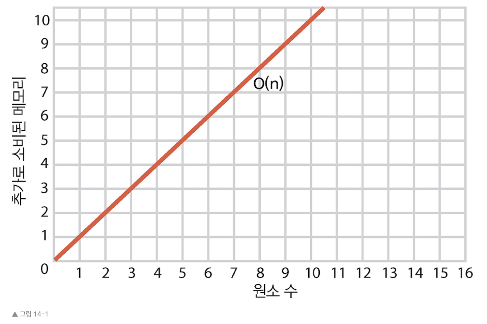
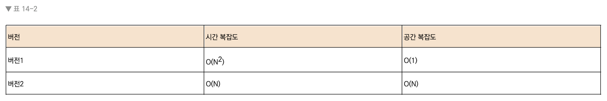

# 14 그래프로 뭐든지 연결하기
전반적으로 알고리즘의 효율성을 시간 복잡도에 초점을 맞췄다. 하지만 또 다른 척도인 공간 복잡도가 있는데, 이는 알고리즘이 얼마나 많은 메모리를 소모하는지를 나타낸다 메모리 제한이 있다면 공간 복잡도가 중요한 요인이다. 


---


## 14.1 공간 복잡도에 빅 오 표기법을 적용
공간 복잡도 역시 시간 복잡도와 마찬가지로 빅 오 표기법을 사용한다. 빅 오를 사용해 알고리즘에 최대 얼마나 많은 공간이 필요한가를 표현할 수 있다.

데이터 원소가 N개일 때, 알고리즘은 메모리 내 추가로 들어 있는 데이터 원소 수에 비례해서 공간을 소모한다. 간단한 예제를 보자.

문자열 배열을 받아 모두 대문자로 바꾼 배열을 반환하는 자바스크립트 함수를 작성한다고 하자. 예를 들어 이 함수는 ["amy", "bob", "cindy", "derek"] 같은 배열을 받아 ["AMY", "BOB", "CINDY", "DEREK"]을 반환한다.

```Javascript
function makeUpperCase(array){

    var newArray = [];

    for(var i=0; i < array.length; i++){

        newArray[i] = array[i].toUpperCase();

    }

    return newArray;

}
```

makeUpperCase() 함수는 array라는 배열을 받고, newArray라는 완전히 새로운 배열을 만들어 대문자로 바꾼 문자열을 채운다.

함수가 끝나면 컴퓨터 메모리에는 두 배열이 들어 있다. ["amy", "bob", "cindy", "derek"]을 포함하는 array와 대문자로 찬 ["AMY", "BOB", "CINDY", "DEREK"]이 든 newArray이다. 

위 함수를 공간 복잡도 관점에서 분석하면 원소 N개를 받아 마찬가지로 원소 N개인 새로운 배열을 생성한다. 따라서 makeUpperCase() 함수 공간의 효율성은 O(N)이다.



위 그래프는 세로축이 속도가 아닌 메모리라는 점만 제외하면 이전 장에서 그래프로 O(N)을 묘사한 방식과 동일하다.

다음은 메모리 효율적인 makeUpperCase() 함수이다.

```Javascript
function makeUpperCase(array){

    for(var i=0; i < array.length; i++){

        array[i] = array[i].toUpperCase();

    }

    return array;

}
```

두 번째 makeUpperCase() 함수는 새 변수나 새 배열을 생성하지 않는다. 사실상 새 메모리를 전혀 소비하지 않는다. 따라서 공간 복잡도는 O(1)이다. 데이터가 얼마나 크든 알고리즘이 소모하는 메모리가 상수란 뜻이다.

즉, 예제 알고리즘은 원래 array가 가진 원소가 4개든 100개든 소비하는 공간은 0으로 같다.(이 책은 보조 공간이라 불리는 '추가로 소비되는 메모리'에 따라 공간 복잡도를 판단한다. 다른 책은 원래 입력도 포함해서 공간 복잡도를 계산하기도 하므로 의미를 잘 파악해야 한다.)

공간 복잡도에 따라 위 예제는 버전2(O(1))가 버전1(O(N))보다 확실하게 더 나은 경우이다.


---


## 14.2 시간과 공간의 트레이드오프
배열에 중복 값이 있는지 확인하는 자바스크립트를 이전에(4.5, 4.6) 함수로 작성하였다.

버전1은 다음과 같았다.

```Javascript
function hasDuplicateValue(array){
    for(var i = 0; i < array.length; i++){
        for(var j = 0; i < array.length; j++){
            if(i !== j && array[i] == array[j]){
                return true;
            }
        }
    }
    return false;
}
```

중첩 for 루프를 사용했으며, 시간 복잡도는 O($N^2$)였다.

다음은 시간 복잡도 면에서 더 효율적이었던 버전2(선형 해결법)이다.

```Javascript
function hasDuplicateValue(array){
    var existingNumbers = [];
    for(var i = 0; i < array.length; i++){
        if(existingNumbers[array[i]] === undefined) {
            existingNumbers[array[i]] = 1;
        } else {    // existingNumbers[array[i]]의 값이 이미 있다면(중복)
            return True;
        }
    } 
    return false;
}

```


버전 2는 existingNumbers라는 배열을 생성해서 array 내 각 수에 대해 existingNumbers에서 대응하는 인덱스를 찾아 값을 1로 채웠다. 시간 복잡도는 O(N)으로 더 빨랐다.

하지만 공간 복잡도를 고려하면 다르다. 버전1은 원래 배열 외에 메모리를 추가로 소모하지 않으므로 공간 복잡도가 O(1)이다. 반면 두 번째 버전은 원래 배열과 같은 크기의 완전히 새로운 배열을 생성한다. 따라서 공간 복잡도가 O(N)이다.



그렇다면 어떤 걸 고를까? 이는 상황에 따라 다르다. 애플리케이션이 매우 빨라야 하고, 처리해야 할 메모리가 충분하면 버전2가 낫다. 반대로 속도는 중요하지 않지만 메모리를 절약해야 하면 버전1이 낫다.


---


# [끝]