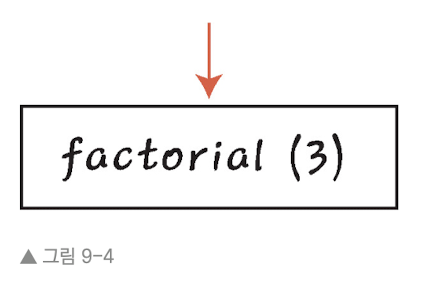
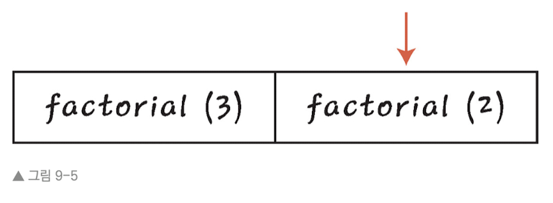
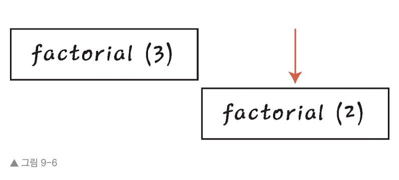
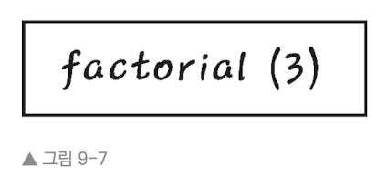
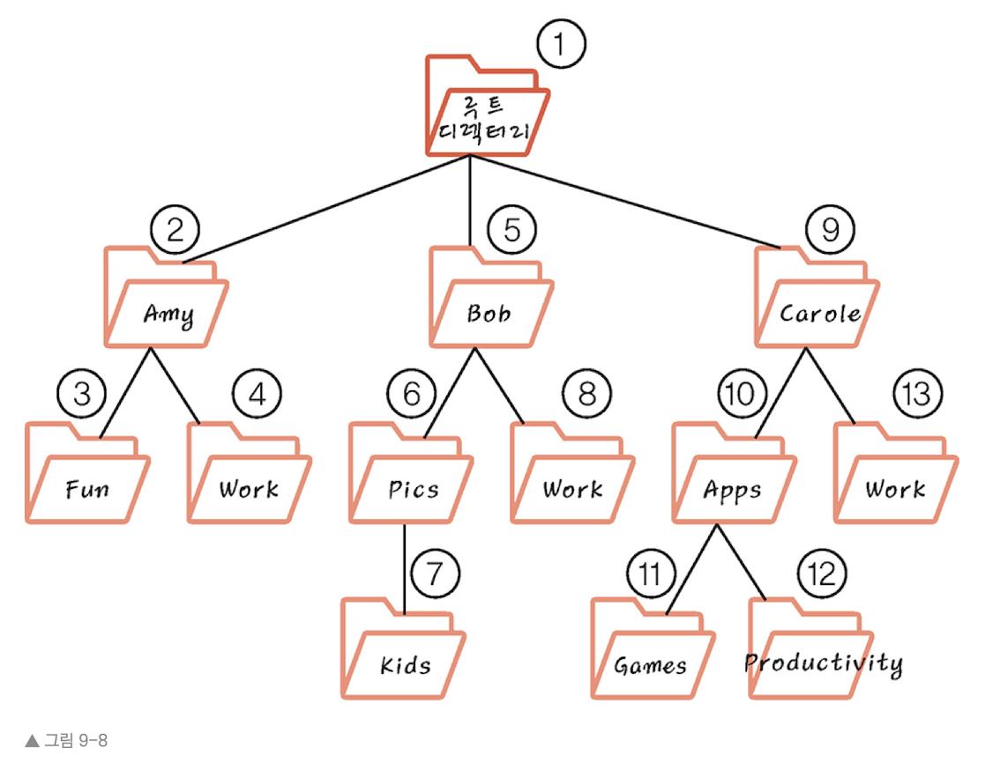

# 재귀를 사용한 재귀적 반복

이후 나올 대부분의 알고리즘을 이해하기 위해서는 재귀(recursion)의 핵심 개념을 알아야 한다. 

만약 아래와 같이 정의한 blah() 함수를 호출하면 무슨 일이 벌어질까?

```Javascript
function blah(){

    blah();

}

```
이 경우 blah()가 자신을 호출하고, 또 blah()가 자신을 반복적으로 호출하면서 함수 자신을 무한대로 호출할 것이다. 이런 무한 함수 호출은 쓸모가 없고 위험하기까지 하지만, 재귀는 활용 가능성이 큰 강력한 도구다.

이어지는 장들에서 다룰 다양한 자료 구도는 모두 노드(node)라는 개념에 기반한다.


---


## 9.1 루프 대신 재귀
우주선 발사에 쓰일 카운트다운 함수를 프로그래밍하자. 어떤 숫자를 받아서 0까지의 숫자를 표시할 것이다.

아래는 자바스크립트로 간단히 구현한 것이다.
```Javascript
function countdown(number){

    for(var i = number; i >= 0; i--){

        console.log(i);

    }
}

countdown(10);
```

구현에 문제는 없지만 사실 루프가 필요 없었을 수 있다. 어떻게 하면 가능할까?

아래는 루프 대신 재귀를 사용하였다.

```Javascript
function countdown(number){

    console.log(number);

    countdown(number - 1);

}

countdown(10)

```
코드를 살펴보자

1. countdown(10)을 호출하므로 인자 number에는 10이 들어 있다.

2. number(값 10이 들어 있음)을 콘솔에 출력한다

3. countdown 함수가 끝나기 전에 countdown(9)를 호출한다.

4. countdown(9)가 실행된다. number(지금은 9)를 콘솔에 출력한다.

5. countdown(9)가 끝나기 전에 countdown(8)을 호출한다.

6. ...

루프를 사용할 수 있는 경우라면 거의 대부분 재귀를 쓸 수 있다. 물론 무조건 써야 한다는 뜻은 아니다. 명쾌한 코드를 작성해 줄 수 있는 하나의 도구일 뿐이다.


---


## 9.2 기저 조건
countdown 함수를 단꼐별로 이어서 살펴보자.

21. countdown(0)을 호출한다.

22. countdown(0)이 실행된다. number(지금은 0)을 콘솔에 출력한다.

23. countdown(-1)을 호출한다.

24. countdown(-1)이 실행된다. number(지금은 -1)을 콘솔에 출력한다.

25. ...

이 방법대로라면 무한대로 계속되며 음수까지 출력하게 된다.

카운트다운을 0에서 끝나고 재귀가 영원히 지속되는 것을 막으려면 어떻게 해야 할까? number가 0이면 더 이상 countdown()을 호출하지 않는 조건문을 추가하면 된다.

```Javascript
function countdown(number){
    console.log(number);
    
    if(number === 0) {
        return;
    } else {
        countdown(number - 1);
    }
}

countdown(10);
```

위와 같이 조건을 추가했다면 number가 0일 때 더 이상 countdown() 함수를 호출하지 않는다. 

재귀에 쓰이는 용어로, 메서드가 반복되지 않는 이러한 경우를 기저 조건(base case, 중단 조건)이라고 부른다. 에제의 countdown() 함수는 0이 기저 조건이다.


---


## 9.3 재귀 코드 읽기
'재귀 코드 읽기', '재귀 코드 작성하기' 두 가지 스킬을 익혀 보자.

계승(factorial)을 계산하는 예제를 살필 것이다. 3의 계승은 3 * 2 * 1 = 6, 5의 계승은 5 * 4 * 3 * 2 * 1 = 120이다.

아래는 주어진 수의 계승을 반환하는 함수를 루비 코드로 구현한다.
```Ruby
def factorial(number)

    if number == 1
        return 1
    
    else
        return number * factorial(number - 1)
    
    end
end

```

재귀 코드를 파악하려면 아래 제시한 순서를 따르자.

1. 기저 조건이 무엇인지 찾는다.

2. 기저 조건을 다룬다는 가정하에 함수를 살펴본다.

3. 기저 조건 바로 전 조건을 다룬다는 가정하에 함수를 살펴본다.

4. 한 번에 한 조건씩 올라가면서 분석한다.

위 절차를 따라서 계승 코드를 보면

1. 함수가 자기 자신을 호출하지 않는 코드 부분이 기저 조건일 것이다. 

2. 기저 조건, 즉 factorial(1)을 처리한다고 가정하면, 메서드는 단순히 1을 반환할 것이다.

3. 기저 조건 바로 전 조건인 factorial(2)를 살펴 보자. factorial(2)를 호출하면 2 * factorial(1)을 반환할 것이다. 즉 2 * 1 = 2가 될 것이다.

4. factorial(3)도 마찬가지로 진행하면 3 * factorial(2) = 3 * 2 = 6이 될 것이다.

이런 과정을 거치며 재귀 코드를 추론하면 된다.


---


## 9.4 컴퓨터의 눈으로 바라본 재귀
factorial 예제를 통해 컴퓨터에서 호출 스택이 어떻게 작동하는지 살펴보자. factorial(3)을 호출할 것이다.

컴퓨터는 factorial(3)를 호출하며 시작한다. 하지만 이 메서드가 종료되기 전에 factorial(2)를 호출한다. 컴퓨터가 아직 factorial(3)을 실행 중인지 알려면 컴퓨터는 이러한 정보를 호출 스택에 푸시해야 한다.



이어서 컴퓨터는 factorial(2)를 실행한다. factorial(2)는 factorial(1)을 호출한다. 하지만 컴퓨터는 factorial(1)을 실행하기 전에 컴퓨터는 아직 factorial(2)를 실행 중임을 기억하기 위해 마찬가지로 호출 스택에 푸시한다.



이어서 컴퓨터는 factorial(1)을 실행한다. 1이 기저 조건이므로 factorial(1)은 factorial 메서드를 호출하지 않고 끝낸다.

하지만 호출 스택에 아직 데이터가 들어 있으므로, 아직 끝내야 할 메서드가 남아 있으므로 컴퓨터는 아직 해야할 일이 끝나지 않았음을 알고 있다. 이전에 언급했듯 **스택은 가장 위(top) 원소만 확인할 수 있다는 제약이 있다.** 따라서 컴퓨터가 다음 할 작업은 호출 스택 top에 있는 원소를 가져오는 것이다. 현재는 factorial(2)이다.



factorial(2)를 pop하고 실행을 마치면 다음 스택을 알아본다. 호출 스택 top에 있는 것이 factorial(3)이므로 스택에서 factorial(3)을 pop하고 완료한다.



이 시점에서 스택은 비게 되고 컴퓨터는 메서드를 모두 실행했음을 알게 되며 재귀가 끝난다.

참고로 맨 처음에 예시로 든 무한 재귀가 있다면 프로그램은 컴퓨터 메모리에 더 이상 공간이 없을 때까지 계속해서 같은 메서드를 호출 스택에 푸시한다. 이로 인해 스택 오버플로라는 오류가 발생한다.


---


## 9.5 재귀 알아보기
NASA 카운트다운과 계승(factorial)을 처리하는 예제는 재귀로 풀 수 있지만, 전형적인 루프로도 쉽게 풀 수 있다. 사실 이런 문제에서는 이점이 없다.

하지만 재귀는 한 알고리즘 내에서 같은 알고리즘을 반복해야 하는 상황에 자연스럽게 들어맞는다. 곧 진행할 예시에 사용하면 보다 읽기 쉬운 코드로 만들 수 있다.

파일시스템을 순회하는 예제를 살펴보자. 어떤 디렉터리 안에 있는 모든 파일에 대해 어떤 작업을 하는 스크립트가 있다고 하자. 하지만 하나의 디렉터리 내에 있는 파일만 처리하는 스크립트가 아니라 하위 디렉터리, 하위 디렉터리 내 하위 디렉터리에 있는 모든 파일까지 수행하려고 한다.

우선 주어진 디렉터리의 모든 하위 디렉터리명을 출력하는 간단한 루비 스크립트를 만들어 보자.(재귀 이용 X)

```Ruby
def find_directories(directory)

    # 바깥 디렉터리를 순회한다.
    Dir.foreach(directory) do |filename|

        if File.directory?("#{directory}/#{filename}") && filename != "." && filename != ".."

            puts "{directory}/#{filename}"
            
            # 안쪽 하위 디렉터리를 순회한다.
            Dir.foreach("#{directory}/#{filename}") do |inner_filename|
                
                if File.directory?("#{directory}/#{filename}/#{inner_filename}") && inner_filename != "." && inner_filename != ".."

                    puts "{directory}/#{filename}/#{inner_filename}"

                end
            
            end

        end

    end

end


# 현재 디렉터리에 대해 find_directories 메서드를 호출한다.

find_directories(".")
```

이제 스크립트는 디렉터리를 찾을 때마다 그 디렉터리의 하위 디렉터리에 대해 동일한 루프를 수행하여 하위 디렉터리명을 수행한다. 하지만 위 스크립트는 한계가 있는데, 두 단계 아래까지만 찾는다. 셋이나 넷, 다섯 단계 밑까지 찾으려면 어떻게 할까?

재귀의 장점이 바로 이것이다. 재귀를 사용하면 원하는 만큼 아래로 가는 스크립트를 작성할 수 있다. 게다가 매우 간단하다.

```Ruby
def find_directories(directory)
    
    Dir.foreach(directory) do |filename|

        if File.directory?("#{directory}/#{filename}") && filename != "." && filename != ".."

            puts "#{directory}/#{filename}"
            
            find_directories("#{directory}/#{filename}")
        
        end
    
    end

end


# 현재 디렉터리에 대해 find_directories 메서드를 호출한다.

find_directories(".")

```

위 스크립트는 파일이 하위 디렉터리면 그 하위 디렉터리에서 find_directories 메서드를 호출한다. 아래는 위 알고리즘이 어떤 순서로 하위 디렉터리를 순회하는지 보여준다.

빅오 측면에서 보면 재귀만으로는 알고리즘의 효율성이 꼭 나아지지는 않는다. 하지만 10장에서 재귀가 알고리즘 속도에 영향을 주는 핵심 요소가 될 수 있음을 학습할 것이다.





---


